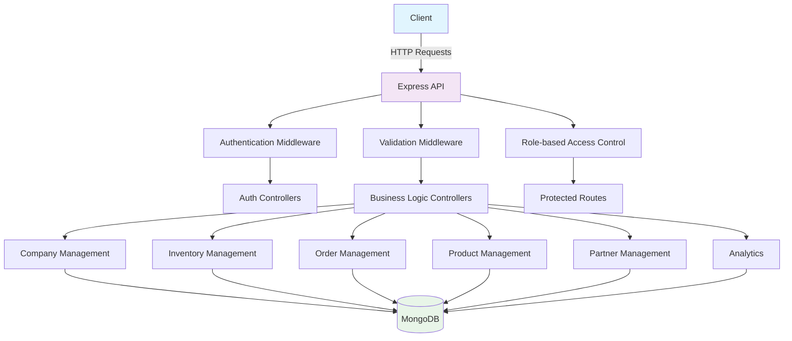

# Supply Chain Management API Documentation

## 📋 Complete Endpoints List

### Authentication & Setup

1. `POST /api/setup/create-platform-admin` - Create platform admin
2. `POST /api/auth/register` - Register new user with company
3. `POST /api/auth/login` - User login
4. `POST /api/auth/logout` - User logout
5. `POST /api/auth/enable-2fa` - Enable two-factor authentication
6. `POST /api/auth/verify-2fa` - Verify 2FA setup
7. `POST /api/auth/confirm-2fa-login` - Confirm 2FA login
8. `POST /api/auth/forgot-password` - Request password reset
9. `POST /api/auth/reset-password` - Reset password
10. `GET /api/auth/verify/:token` - Verify email
11. `GET /api/auth/resend-verification` - Resend verification email

### Company Management

12. `GET /api/company` - Get all companies (Admin only)

### Team Management

13. `POST /api/team/invite` - Invite team member
14. `GET /api/team/verify-invite/:token` - Verify team invitation

### User Management

15. `GET /api/user` - Get all users in company
16. `GET /api/user/avatar` - Get user avatar
17. `POST /api/user/avatar` - Upload user avatar
18. `DELETE /api/user/avatar` - Delete user avatar

### Partner Connections

19. `POST /api/partner-connection` - Create partner connection
20. `GET /api/partner-connection` - Get all partner connections
21. `GET /api/partner-connection/:connectionId` - Get specific connection
22. `PATCH /api/partner-connection/:connectionId` - Update connection status

### Inventory Management

23. `GET /api/inventory` - Get all inventory items
24. `GET /api/inventory/:id` - Get specific inventory item
25. `PATCH /api/inventory/:id` - Update inventory item

### Location Management

26. `GET /api/location` - Get all locations
27. `GET /api/location/:id` - Get specific location
28. `POST /api/location` - Create new location
29. `PUT /api/location/:id` - Update location
30. `DELETE /api/location/:id` - Delete location

### Product Management

31. `GET /api/product` - Get all products
32. `GET /api/product/:id` - Get specific product
33. `POST /api/product` - Create new product
34. `PATCH /api/product/:id` - Update product
35. `DELETE /api/product/:id` - Delete product

### Order Management

36. `GET /api/order` - Get company orders
37. `GET /api/order/:orderId` - Get specific order
38. `POST /api/order/:supplierId` - Create new order
39. `PATCH /api/order/:orderId` - Update order
40. `POST /api/order/:orderId/validate` - Validate order items
41. `POST /api/order/:orderId/return` - Return order
42. `PATCH /api/order/:orderId/process-return` - Process return

### Invoice Management

43. `POST /api/invoice/from-order/:orderId` - Generate invoice from order
44. `GET /api/invoice` - Get company invoices
45. `GET /api/invoice/:invoiceId` - Get specific invoice
46. `GET /api/invoice/:invoiceId/pdf` - Download invoice PDF

### Notification Management

47. `GET /api/notification` - Get all notifications
48. `GET /api/notification/:id` - Get specific notification
49. `POST /api/notification` - Create notification
50. `PATCH /api/notification/:id/read` - Mark notification as read
51. `PATCH /api/notification/read-all` - Mark all notifications as read
52. `DELETE /api/notification/:id` - Delete notification
53. `DELETE /api/notification` - Delete all notifications

### Analytics

54. `GET /api/analytics/kpis` - Get company KPIs

---

## 🗺️ Architecture Overview



---

## 📊 System Enums

### User Roles

```javascript
const roleEnum = ["admin", "manager", "staff", "platform_admin"];
```

### User Status

```javascript
const userStatus = {
  ACTIVE: "active",
  INACTIVE: "inactive",
  PENDING: "pending",
  SUSPENDED: "suspended",
};
```

### Company Status

```javascript
const companyStatus = {
  PENDING: "pending",
  APPROVED: "approved",
  REJECTED: "rejected",
  SUSPENDED: "suspended",
};
```

### Order Status

```javascript
const orderStatus = {
  CREATED: "created",
  PENDING: "pending",
  CONFIRMED: "confirmed",
  PROCESSING: "processing",
  SHIPPED: "shipped",
  DELIVERED: "delivered",
  CANCELLED: "cancelled",
  RETURNED: "returned",
};
```

### Inventory Change Types

```javascript
const inventoryChangeType = {
  RESERVED: "reserved",
  RELEASED: "released",
  RECEIVED: "received",
  SHIPPED: "shipped",
  ADJUSTED: "adjusted",
  TRANSFERRED: "transferred",
};
```

### Location Types

```javascript
const locationType = {
  WAREHOUSE: "warehouse",
  STORE: "store",
  OFFICE: "office",
  FACTORY: "factory",
  DISTRIBUTION_CENTER: "distribution_center",
};
```

### Notification Types

```javascript
const notificationType = {
  ORDER: "order",
  INVENTORY: "inventory",
  SHIPMENT: "shipment",
  SYSTEM: "system",
  PARTNER: "partner",
};
```

### Notification Priority

```javascript
const notificationPriority = {
  LOW: "low",
  MEDIUM: "medium",
  HIGH: "high",
  URGENT: "urgent",
};
```

---

## 🔐 Authentication & Setup

### 1. Create Platform Admin

**Endpoint:** `POST /api/setup/create-platform-admin`

**Description:** Creates the initial platform administrator (only works in development mode)

**Request Body:**

```json
{
  "name": "Admin Name",
  "email": "admin@example.com",
  "password": "StrongPassword123!"
}
```

**Success Response (201):**

```json
{
  "status": "success",
  "message": "Platform admin created successfully",
  "data": {
    "user": {
      "_id": "64f1a2b3c4d5e6f7a8b9c0d1",
      "name": "Admin Name",
      "email": "admin@example.com",
      "role": "platform_admin"
    }
  }
}
```

**Error Responses:**

**400 - Validation Error:**

```json
{
  "status": "error",
  "message": "Validation failed",
  "errors": [
    {
      "field": "email",
      "message": "Email is required"
    },
    {
      "field": "password",
      "message": "Password must be at least 8 characters"
    }
  ]
}
```

**409 - Admin Already Exists:**

```json
{
  "status": "error",
  "message": "Platform admin already exists"
}
```

**Notes:**

- This endpoint can only be called once to create the initial admin
- Password must be at least 8 characters with uppercase, lowercase, number, and special character
- Email must be unique and valid format

---

### 2. Register New User

**Endpoint:** `POST /api/auth/register`

**Description:** Register a new user with company information

**Request Body (Multipart Form):**

```json
{
  "name": "John Doe",
  "email": "john@company.com",
  "password": "StrongPassword123!",
  "companyName": "Tech Solutions Ltd",
  "companyEmail": "info@techsolutions.com",
  "companyPhone": "+1234567890",
  "companyAddress": "123 Business St, City, Country",
  "documents": Company Registration Documents
}
```

**Success Response (201):**

```json
{
  "status": "success",
  "message": "Registration successful. Please check your email for verification.",
  "data": {
    "user": {
      "_id": "64f1a2b3c4d5e6f7a8b9c0d1",
      "name": "John Doe",
      "email": "john@company.com",
      "role": "admin"
    },
    "company": {
      "_id": "64f1a2b3c4d5e6f7a8b9c0d2",
      "companyName": "Tech Solutions Ltd",
      "status": "pending"
    }
  }
}
```

**Error Responses:**

**400 - Validation Error:**

```json
{
  "status": "error",
  "message": "Validation failed",
  "errors": [
    {
      "field": "email",
      "message": "Email already exists"
    },
    {
      "field": "companyName",
      "message": "Company name is required"
    }
  ]
}
```

**413 - File Too Large:**

```json
{
  "status": "error",
  "message": "File size too large. Maximum size is 5MB"
}
```

**Notes:**

- Supports file upload for company documents
- Company status starts as "pending" until approved by admin
- Email verification required before login
- Password must meet security requirements

---

### 3. User Login

**Endpoint:** `POST /api/auth/login`

**Description:** Authenticate user and return access token

**Request Body:**

```json
{
  "email": "john@company.com",
  "password": "StrongPassword123!"
}
```

**Success Response (200):**

```json
{
  "status": "success",
  "message": "Login successful",
  "data": {
    "user": {
      "_id": "64f1a2b3c4d5e6f7a8b9c0d1",
      "name": "John Doe",
      "email": "john@company.com",
      "role": "admin",
      "company": {
        "_id": "64f1a2b3c4d5e6f7a8b9c0d2",
        "companyName": "Tech Solutions Ltd",
        "status": "approved"
      }
    },
    "token": "eyJhbGciOiJIUzI1NiIsInR5cCI6IkpXVCJ9..."
  }
}
```

**Error Responses:**

**400 - Invalid Credentials:**

```json
{
  "status": "error",
  "message": "Invalid email or password"
}
```

**401 - Email Not Verified:**

```json
{
  "status": "error",
  "message": "Please verify your email before logging in"
}
```

**401 - Company Not Approved:**

```json
{
  "status": "error",
  "message": "Your company is pending approval"
}
```

**401 - Account Suspended:**

```json
{
  "status": "error",
  "message": "Your account has been suspended"
}
```

**Notes:**

- Email must be verified before login
- Company must be approved by admin
- Account must be active (not suspended)
- Token expires in 7 days

---

### 4. Enable 2FA

**Endpoint:** `POST /api/auth/enable-2fa`

**Description:** Enable two-factor authentication for user account

**Headers:**

```
Authorization: Bearer <token>
```

**Request Body:**

```json
{
  "enable": true
}
```

**Success Response (200):**

```json
{
  "status": "success",
  "message": "2FA setup initiated",
  "data": {
    "qrCode": "data:image/png;base64,iVBORw0KGgoAAAANSUhEUgAA...",
    "secret": "JBSWY3DPEHPK3PXP",
    "backupCodes": ["123456", "234567", "345678", "456789", "567890"]
  }
}
```

**Error Responses:**

**401 - Unauthorized:**

```json
{
  "status": "error",
  "message": "Please login to continue"
}
```

**400 - Already Enabled:**

```json
{
  "status": "error",
  "message": "2FA is already enabled for this account"
}
```

**Notes:**

- Requires email verification
- Generates QR code for authenticator apps
- Provides backup codes for account recovery
- Must verify 2FA setup before activation

---

### 5. Verify 2FA Setup

**Endpoint:** `POST /api/auth/verify-2fa`

**Description:** Verify 2FA setup with authenticator code

**Request Body:**

```json
{
  "code": "123456"
}
```

**Success Response (200):**

```json
{
  "status": "success",
  "message": "2FA enabled successfully"
}
```

**Error Responses:**

**400 - Invalid Code:**

```json
{
  "status": "error",
  "message": "Invalid verification code"
}
```

**400 - Code Expired:**

```json
{
  "status": "error",
  "message": "Verification code has expired"
}
```

**Notes:**

- Code must be entered within 5 minutes
- Uses TOTP (Time-based One-Time Password) standard
- Compatible with Google Authenticator, Authy, etc.

---

### 6. Confirm 2FA Login

**Endpoint:** `POST /api/auth/confirm-2fa-login`

**Description:** Complete login with 2FA code

**Request Body:**

```json
{
  "email": "john@company.com",
  "code": "123456"
}
```

**Success Response (200):**

```json
{
  "status": "success",
  "message": "2FA verification successful",
  "data": {
    "user": {
      "_id": "64f1a2b3c4d5e6f7a8b9c0d1",
      "name": "John Doe",
      "email": "john@company.com"
    },
    "token": "eyJhbGciOiJIUzI1NiIsInR5cCI6IkpXVCJ9..."
  }
}
```

**Error Responses:**

**400 - Invalid Code:**

```json
{
  "status": "error",
  "message": "Invalid 2FA code"
}
```

**401 - 2FA Not Enabled:**

```json
{
  "status": "error",
  "message": "2FA is not enabled for this account"
}
```

**Notes:**

- Used after initial login when 2FA is enabled
- Code must be current (30-second window)
- Backup codes can be used instead of authenticator code

---

### 7. Forgot Password

**Endpoint:** `POST /api/auth/forgot-password`

**Description:** Request password reset email

**Request Body:**

```json
{
  "email": "john@company.com"
}
```

**Success Response (200):**

```json
{
  "status": "success",
  "message": "Password reset email sent"
}
```

**Error Responses:**

**404 - Email Not Found:**

```json
{
  "status": "error",
  "message": "No account found with this email"
}
```

**429 - Too Many Requests:**

```json
{
  "status": "error",
  "message": "Too many reset attempts. Please try again later"
}
```

**Notes:**

- Rate limited to prevent abuse
- Reset token expires in 1 hour
- Email sent only if account exists (security)

---

### 8. Reset Password

**Endpoint:** `POST /api/auth/reset-password`

**Description:** Reset password using reset token

**Request Body:**

```json
{
  "token": "reset_token_here",
  "password": "NewStrongPassword123!"
}
```

**Success Response (200):**

```json
{
  "status": "success",
  "message": "Password reset successfully"
}
```

**Error Responses:**

**400 - Invalid Token:**

```json
{
  "status": "error",
  "message": "Invalid or expired reset token"
}
```

**400 - Weak Password:**

```json
{
  "status": "error",
  "message": "Password must be at least 8 characters with uppercase, lowercase, number, and special character"
}
```

**Notes:**

- Token must be valid and not expired
- New password must meet security requirements
- All existing sessions are invalidated

---

### 9. Verify Email

**Endpoint:** `GET /api/auth/verify/:token`

**Description:** Verify email address with verification token

**Parameters:**

- `token` (string, required): Email verification token

**Success Response (200):**

```json
{
  "status": "success",
  "message": "Email verified successfully"
}
```

**Error Responses:**

**400 - Invalid Token:**

```json
{
  "status": "error",
  "message": "Invalid or expired verification token"
}
```

**400 - Already Verified:**

```json
{
  "status": "error",
  "message": "Email is already verified"
}
```

**Notes:**

- Token expires in 24 hours
- Can only be used once
- Required before login

---

### 10. Resend Verification Email

**Endpoint:** `GET /api/auth/resend-verification`

**Description:** Resend email verification link

**Headers:**

```
Authorization: Bearer <token>
```

**Success Response (200):**

```json
{
  "status": "success",
  "message": "Verification email sent"
}
```

**Error Responses:**

**400 - Already Verified:**

```json
{
  "status": "error",
  "message": "Email is already verified"
}
```

**429 - Too Many Requests:**

```json
{
  "status": "error",
  "message": "Too many verification requests. Please try again later"
}
```

**Notes:**

- Rate limited to prevent spam
- Requires authentication
- Only works for unverified emails

---

### 11. Logout

**Endpoint:** `POST /api/auth/logout`

**Description:** Logout user and invalidate token

**Headers:**

```
Authorization: Bearer <token>
```

**Success Response (200):**

```json
{
  "status": "success",
  "message": "Logged out successfully"
}
```

**Error Responses:**

**401 - Invalid Token:**

```json
{
  "status": "error",
  "message": "Invalid token"
}
```

**Notes:**

- Token is blacklisted
- All subsequent requests with this token will fail
- No response body required

---

## 🏢 Company Management

### 12. Get All Companies

**Endpoint:** `GET /api/company`

**Description:** Get all companies in the system (Admin only)

**Headers:**

```
Authorization: Bearer <token>
```

**Query Parameters:**

- `page` (number, optional): Page number for pagination (default: 1)
- `limit` (number, optional): Number of items per page (default: 10)
- `status` (string, optional): Filter by company status
- `search` (string, optional): Search by company name or email

**Success Response (200):**

```json
{
  "status": "success",
  "results": 5,
  "page": 1,
  "limit": 10,
  "total": 25,
  "totalPages": 3,
  "data": [
    {
      "_id": "64f1a2b3c4d5e6f7a8b9c0d1",
      "companyName": "Tech Solutions Ltd",
      "email": "info@techsolutions.com",
      "phone": "+1234567890",
      "status": "approved",
      "createdAt": "2024-01-01T00:00:00.000Z",
      "approvedAt": "2024-01-02T00:00:00.000Z",
      "approvedBy": {
        "_id": "64f1a2b3c4d5e6f7a8b9c0d2",
        "name": "Platform Admin"
      }
    }
  ]
}
```

**Error Responses:**

**401 - Unauthorized:**

```json
{
  "status": "error",
  "message": "Please login to continue"
}
```

**403 - Insufficient Permissions:**

```json
{
  "status": "error",
  "message": "You don't have permission to access this resource"
}
```

**400 - Invalid Query Parameters:**

```json
{
  "status": "error",
  "message": "Invalid query parameters",
  "errors": [
    {
      "field": "page",
      "message": "Page must be a positive number"
    }
  ]
}
```

**Notes:**

- Requires admin, manager, staff, or platform_admin role
- Supports pagination and filtering
- Company status can be: "pending", "approved", "rejected", "suspended"
- Search works on company name and email fields

---

## 👥 Team Management

### 13. Invite Team Member

**Endpoint:** `POST /api/team/invite`

**Description:** Invite a new user to join the company team

**Headers:**

```
Authorization: Bearer <token>
```

**Request Body:**

```json
{
  "email": "newuser@company.com",
  "role": "staff",
  "message": "Welcome to our team! Please join us."
}
```

**Success Response (201):**

```json
{
  "status": "success",
  "message": "Invitation sent successfully",
  "data": {
    "invitation": {
      "_id": "64f1a2b3c4d5e6f7a8b9c0d1",
      "email": "newuser@company.com",
      "role": "staff",
      "status": "pending",
      "expiresAt": "2024-01-08T00:00:00.000Z"
    }
  }
}
```

**Error Responses:**

**401 - Unauthorized:**

```json
{
  "status": "error",
  "message": "Please login to continue"
}
```

**403 - Insufficient Permissions:**

```json
{
  "status": "error",
  "message": "Only admins can invite team members"
}
```

**400 - Validation Error:**

```json
{
  "status": "error",
  "message": "Validation failed",
  "errors": [
    {
      "field": "email",
      "message": "Email is required and must be valid"
    },
    {
      "field": "role",
      "message": "Role must be one of: admin, manager, staff"
    }
  ]
}
```

**409 - User Already Exists:**

```json
{
  "status": "error",
  "message": "User with this email already exists in the company"
}
```

**429 - Too Many Invitations:**

```json
{
  "status": "error",
  "message": "Too many invitations sent. Please try again later"
}
```

**Notes:**

- Requires admin role
- Email must be verified
- Role must be one of: "admin", "manager", "staff"
- Invitation expires in 7 days
- Rate limited to prevent spam

---

### 14. Verify Team Invitation

**Endpoint:** `GET /api/team/verify-invite/:token`

**Description:** Verify team invitation token and get invitation details

**Parameters:**

- `token` (string, required): Invitation token

**Success Response (200):**

```json
{
  "status": "success",
  "data": {
    "invitation": {
      "_id": "64f1a2b3c4d5e6f7a8b9c0d1",
      "email": "newuser@company.com",
      "role": "staff",
      "company": {
        "_id": "64f1a2b3c4d5e6f7a8b9c0d2",
        "companyName": "Tech Solutions Ltd"
      },
      "invitedBy": {
        "_id": "64f1a2b3c4d5e6f7a8b9c0d3",
        "name": "John Doe"
      },
      "expiresAt": "2024-01-08T00:00:00.000Z",
      "isValid": true
    }
  }
}
```

**Error Responses:**

**400 - Invalid Token:**

```json
{
  "status": "error",
  "message": "Invalid or expired invitation token"
}
```

**410 - Invitation Expired:**

```json
{
  "status": "error",
  "message": "Invitation has expired"
}
```

**409 - Invitation Already Used:**

```json
{
  "status": "error",
  "message": "Invitation has already been used"
}
```

**Notes:**

- Token must be valid and not expired
- Can only be used once
- Returns invitation details for user to review before accepting

---

## 👤 User Management

### 15. Get All Users in Company

**Endpoint:** `GET /api/user`

**Description:** Get all users in the current user's company

**Headers:**

```
Authorization: Bearer <token>
```

**Query Parameters:**

- `page` (number, optional): Page number for pagination (default: 1)
- `limit` (number, optional): Number of items per page (default: 10)
- `role` (string, optional): Filter by user role
- `status` (string, optional): Filter by user status
- `search` (string, optional): Search by name or email

**Success Response (200):**

```json
{
  "status": "success",
  "results": 3,
  "page": 1,
  "limit": 10,
  "total": 3,
  "totalPages": 1,
  "data": [
    {
      "_id": "64f1a2b3c4d5e6f7a8b9c0d1",
      "name": "John Doe",
      "email": "john@company.com",
      "role": "admin",
      "status": "active",
      "avatar": "https://example.com/avatar1.jpg",
      "lastLogin": "2024-01-01T12:00:00.000Z",
      "createdAt": "2024-01-01T00:00:00.000Z"
    }
  ]
}
```

**Error Responses:**

**401 - Unauthorized:**

```json
{
  "status": "error",
  "message": "Please login to continue"
}
```

**400 - Invalid Query Parameters:**

```json
{
  "status": "error",
  "message": "Invalid query parameters",
  "errors": [
    {
      "field": "role",
      "message": "Role must be one of: admin, manager, staff"
    }
  ]
}
```

**Notes:**

- Requires authentication
- Only shows users from the same company
- Role can be: "admin", "manager", "staff"
- Status can be: "active", "inactive", "pending", "suspended"
- Supports pagination and filtering

---

### 16. Get User Avatar

**Endpoint:** `GET /api/user/avatar`

**Description:** Get the current user's avatar

**Headers:**

```
Authorization: Bearer <token>
```

**Success Response (200):**

```json
{
  "status": "success",
  "data": {
    "avatar": "https://example.com/avatar1.jpg",
    "hasAvatar": true
  }
}
```

**Error Responses:**

**401 - Unauthorized:**

```json
{
  "status": "error",
  "message": "Please login to continue"
}
```

**404 - No Avatar:**

```json
{
  "status": "error",
  "message": "No avatar found for this user"
}
```

**Notes:**

- Returns avatar URL if exists
- Returns hasAvatar flag to indicate if user has uploaded an avatar

---

### 17. Upload User Avatar

**Endpoint:** `POST /api/user/avatar`

**Description:** Upload or update user avatar

**Headers:**

```
Authorization: Bearer <token>
Content-Type: multipart/form-data
```

**Request Body (Multipart Form):**

```
avatar: [Image File] // Required: JPG, PNG, or GIF, max 5MB
```

**Success Response (200):**

```json
{
  "status": "success",
  "message": "Avatar uploaded successfully",
  "data": {
    "avatar": "https://example.com/avatar1.jpg",
    "filename": "avatar_123456.jpg"
  }
}
```

**Error Responses:**

**401 - Unauthorized:**

```json
{
  "status": "error",
  "message": "Please login to continue"
}
```

**400 - No File:**

```json
{
  "status": "error",
  "message": "Please upload an image file"
}
```

**400 - Invalid File Type:**

```json
{
  "status": "error",
  "message": "Only JPG, PNG, and GIF files are allowed"
}
```

**413 - File Too Large:**

```json
{
  "status": "error",
  "message": "File size too large. Maximum size is 5MB"
}
```

**500 - Upload Failed:**

```json
{
  "status": "error",
  "message": "Failed to upload avatar. Please try again"
}
```

**Notes:**

- Supports JPG, PNG, and GIF formats
- Maximum file size: 5MB
- Automatically resizes large images
- Replaces existing avatar if one exists

---

### 18. Delete User Avatar

**Endpoint:** `DELETE /api/user/avatar`

**Description:** Delete user's avatar

**Headers:**

```
Authorization: Bearer <token>
```

**Success Response (200):**

```json
{
  "status": "success",
  "message": "Avatar deleted successfully"
}
```

**Error Responses:**

**401 - Unauthorized:**

```json
{
  "status": "error",
  "message": "Please login to continue"
}
```

**404 - No Avatar:**

```json
{
  "status": "error",
  "message": "No avatar found for this user"
}
```

**500 - Delete Failed:**

```json
{
  "status": "error",
  "message": "Failed to delete avatar. Please try again"
}
```

**Notes:**

- Removes avatar from storage
- Updates user record to remove avatar reference
- No confirmation required

---

## 🤝 Partner Connection Management

### 19. Create Partner Connection

**Endpoint:** `POST /api/partner-connection`

**Description:** Create a new partner connection request

**Headers:**

```
Authorization: Bearer <token>
```

**Request Body:**

```json
{
  "partnerCompanyId": "64f1a2b3c4d5e6f7a8b9c0d1",
  "message": "We would like to establish a business partnership with your company."
}
```

**Success Response (201):**

```json
{
  "status": "success",
  "message": "Partner connection request sent successfully",
  "data": {
    "connection": {
      "_id": "64f1a2b3c4d5e6f7a8b9c0d2",
      "requester": {
        "_id": "64f1a2b3c4d5e6f7a8b9c0d3",
        "companyName": "Tech Solutions Ltd"
      },
      "recipient": {
        "_id": "64f1a2b3c4d5e6f7a8b9c0d1",
        "companyName": "Partner Company"
      },
      "status": "pending",
      "message": "We would like to establish a business partnership with your company.",
      "createdAt": "2024-01-01T00:00:00.000Z"
    }
  }
}
```

**Error Responses:**

**401 - Unauthorized:**

```json
{
  "status": "error",
  "message": "Please login to continue"
}
```

**400 - Validation Error:**

```json
{
  "status": "error",
  "message": "Validation failed",
  "errors": [
    {
      "field": "partnerCompanyId",
      "message": "Partner company ID is required"
    }
  ]
}
```

**404 - Company Not Found:**

```json
{
  "status": "error",
  "message": "Partner company not found"
}
```

**409 - Self Connection:**

```json
{
  "status": "error",
  "message": "Cannot create connection with your own company"
}
```

**409 - Connection Already Exists:**

```json
{
  "status": "error",
  "message": "Connection already exists with this company"
}
```

**Notes:**

- Requires email verification
- Cannot connect with own company
- Connection status starts as "pending"
- Partner company must be approved

---

### 20. Get All Partner Connections

**Endpoint:** `GET /api/partner-connection`

**Description:** Get all partner connections for the current company

**Headers:**

```
Authorization: Bearer <token>
```

**Query Parameters:**

- `page` (number, optional): Page number for pagination (default: 1)
- `limit` (number, optional): Number of items per page (default: 10)
- `status` (string, optional): Filter by connection status
- `type` (string, optional): Filter by connection type ("sent" or "received")

**Success Response (200):**

```json
{
  "status": "success",
  "results": 2,
  "page": 1,
  "limit": 10,
  "total": 2,
  "totalPages": 1,
  "data": [
    {
      "_id": "64f1a2b3c4d5e6f7a8b9c0d1",
      "requester": {
        "_id": "64f1a2b3c4d5e6f7a8b9c0d2",
        "companyName": "Tech Solutions Ltd"
      },
      "recipient": {
        "_id": "64f1a2b3c4d5e6f7a8b9c0d3",
        "companyName": "Partner Company"
      },
      "status": "active",
      "message": "We would like to establish a business partnership with your company.",
      "createdAt": "2024-01-01T00:00:00.000Z",
      "acceptedAt": "2024-01-02T00:00:00.000Z",
      "connectionType": "sent"
    }
  ]
}
```

**Error Responses:**

**401 - Unauthorized:**

```json
{
  "status": "error",
  "message": "Please login to continue"
}
```

**400 - Invalid Query Parameters:**

```json
{
  "status": "error",
  "message": "Invalid query parameters",
  "errors": [
    {
      "field": "status",
      "message": "Status must be one of: pending, active, rejected, terminated"
    }
  ]
}
```

**Notes:**

- Requires email verification
- Status can be: "pending", "active", "rejected", "terminated"
- Type can be: "sent", "received", or "all"
- Supports pagination and filtering

---

### 21. Get Specific Partner Connection

**Endpoint:** `GET /api/partner-connection/:connectionId`

**Description:** Get details of a specific partner connection

**Headers:**

```
Authorization: Bearer <token>
```

**Parameters:**

- `connectionId` (string, required): Partner connection ID

**Success Response (200):**

```json
{
  "status": "success",
  "data": {
    "_id": "64f1a2b3c4d5e6f7a8b9c0d1",
    "requester": {
      "_id": "64f1a2b3c4d5e6f7a8b9c0d2",
      "companyName": "Tech Solutions Ltd",
      "email": "info@techsolutions.com",
      "phone": "+1234567890"
    },
    "recipient": {
      "_id": "64f1a2b3c4d5e6f7a8b9c0d3",
      "companyName": "Partner Company",
      "email": "info@partnercompany.com",
      "phone": "+0987654321"
    },
    "status": "active",
    "message": "We would like to establish a business partnership with your company.",
    "createdAt": "2024-01-01T00:00:00.000Z",
    "acceptedAt": "2024-01-02T00:00:00.000Z",
    "acceptedBy": {
      "_id": "64f1a2b3c4d5e6f7a8b9c0d4",
      "name": "Partner Admin"
    }
  }
}
```

**Error Responses:**

**401 - Unauthorized:**

```json
{
  "status": "error",
  "message": "Please login to continue"
}
```

**403 - Insufficient Permissions:**

```json
{
  "status": "error",
  "message": "You don't have permission to access this connection"
}
```

**404 - Connection Not Found:**

```json
{
  "status": "error",
  "message": "Partner connection not found"
}
```

**Notes:**

- Requires admin role
- Only shows connections involving the user's company
- Includes detailed company information

---

### 22. Update Partner Connection Status

**Endpoint:** `PATCH /api/partner-connection/:connectionId`

**Description:** Update partner connection status (accept/reject/terminate)

**Headers:**

```
Authorization: Bearer <token>
```

**Parameters:**

- `connectionId` (string, required): Partner connection ID

**Request Body:**

```json
{
  "status": "active",
  "message": "We accept your partnership request."
}
```

**Success Response (200):**

```json
{
  "status": "success",
  "message": "Partner connection updated successfully",
  "data": {
    "_id": "64f1a2b3c4d5e6f7a8b9c0d1",
    "status": "active",
    "message": "We accept your partnership request.",
    "updatedAt": "2024-01-02T00:00:00.000Z"
  }
}
```

**Error Responses:**

**401 - Unauthorized:**

```json
{
  "status": "error",
  "message": "Please login to continue"
}
```

**403 - Insufficient Permissions:**

```json
{
  "status": "error",
  "message": "Only admins can update connection status"
}
```

**400 - Validation Error:**

```json
{
  "status": "error",
  "message": "Validation failed",
  "errors": [
    {
      "field": "status",
      "message": "Status must be one of: active, rejected, terminated"
    }
  ]
}
```

**404 - Connection Not Found:**

```json
{
  "status": "error",
  "message": "Partner connection not found"
}
```

**409 - Invalid Status Change:**

```json
{
  "status": "error",
  "message": "Cannot change status from pending to terminated"
}
```

**Notes:**

- Requires admin role
- Status can be: "active", "rejected", "terminated"
- Cannot change status from "pending" to "terminated"
- Only recipient can accept/reject pending connections
- Both parties can terminate active connections

---

## 📦 Inventory Management

### 23. Get All Inventory Items

**Endpoint:** `GET /api/inventory`

**Description:** Get all inventory items for the current company

**Headers:**

```
Authorization: Bearer <token>
```

**Query Parameters:**

- `page` (number, optional): Page number for pagination (default: 1)
- `limit` (number, optional): Number of items per page (default: 10)
- `status` (string, optional): Filter by inventory status
- `location` (string, optional): Filter by location ID
- `search` (string, optional): Search by product name or SKU
- `lowStock` (boolean, optional): Filter items with low stock

**Success Response (200):**

```json
{
  "status": "success",
  "results": 3,
  "page": 1,
  "limit": 10,
  "total": 3,
  "totalPages": 1,
  "data": [
    {
      "_id": "64f1a2b3c4d5e6f7a8b9c0d1",
      "product": {
        "_id": "64f1a2b3c4d5e6f7a8b9c0d2",
        "name": "Laptop",
        "sku": "LAP-001"
      },
      "location": {
        "_id": "64f1a2b3c4d5e6f7a8b9c0d3",
        "locationName": "Main Warehouse"
      },
      "onHand": 50,
      "reserved": 10,
      "available": 40,
      "status": "in_stock",
      "lastUpdated": "2024-01-01T12:00:00.000Z"
    }
  ]
}
```

**Error Responses:**

**401 - Unauthorized:**

```json
{
  "status": "error",
  "message": "Please login to continue"
}
```

**400 - Invalid Query Parameters:**

```json
{
  "status": "error",
  "message": "Invalid query parameters",
  "errors": [
    {
      "field": "status",
      "message": "Status must be one of: in_stock, low_stock, out_of_stock"
    }
  ]
}
```

**Notes:**

- Requires admin, manager, or staff role
- Status can be: "in_stock", "low_stock", "out_of_stock"
- Available = onHand - reserved
- Supports pagination and filtering

---

### 24. Get Specific Inventory Item

**Endpoint:** `GET /api/inventory/:id`

**Description:** Get details of a specific inventory item

**Headers:**

```
Authorization: Bearer <token>
```

**Parameters:**

- `id` (string, required): Inventory item ID

**Success Response (200):**

```json
{
  "status": "success",
  "data": {
    "_id": "64f1a2b3c4d5e6f7a8b9c0d1",
    "product": {
      "_id": "64f1a2b3c4d5e6f7a8b9c0d2",
      "name": "Laptop",
      "sku": "LAP-001",
      "description": "High-performance laptop",
      "unitPrice": 999.99
    },
    "location": {
      "_id": "64f1a2b3c4d5e6f7a8b9c0d3",
      "locationName": "Main Warehouse",
      "address": "123 Warehouse St"
    },
    "onHand": 50,
    "reserved": 10,
    "available": 40,
    "status": "in_stock",
    "lastUpdated": "2024-01-01T12:00:00.000Z",
    "history": [
      {
        "changeType": "received",
        "quantityChange": {
          "onHand": 20,
          "reserved": 0
        },
        "before": {
          "onHand": 30,
          "reserved": 10
        },
        "after": {
          "onHand": 50,
          "reserved": 10
        },
        "reason": "New shipment received",
        "performedBy": {
          "_id": "64f1a2b3c4d5e6f7a8b9c0d4",
          "name": "John Doe"
        },
        "createdAt": "2024-01-01T12:00:00.000Z"
      }
    ]
  }
}
```

**Error Responses:**

**401 - Unauthorized:**

```json
{
  "status": "error",
  "message": "Please login to continue"
}
```

**404 - Inventory Not Found:**

```json
{
  "status": "error",
  "message": "Inventory item not found"
}
```

**403 - Insufficient Permissions:**

```json
{
  "status": "error",
  "message": "You don't have permission to access this inventory item"
}
```

**Notes:**

- Requires admin, manager, or staff role
- Only shows inventory from the same company
- Includes detailed product and location information
- Shows inventory history for tracking changes

---

### 25. Update Inventory Item

**Endpoint:** `PATCH /api/inventory/:id`

**Description:** Update inventory quantities and status

**Headers:**

```
Authorization: Bearer <token>
```

**Parameters:**

- `id` (string, required): Inventory item ID

**Request Body:**

```json
{
  "onHand": 60,
  "reserved": 15,
  "reason": "Manual adjustment after physical count",
  "changeType": "adjusted"
}
```

**Success Response (200):**

```json
{
  "status": "success",
  "message": "Inventory updated successfully",
  "data": {
    "_id": "64f1a2b3c4d5e6f7a8b9c0d1",
    "onHand": 60,
    "reserved": 15,
    "available": 45,
    "status": "in_stock",
    "lastUpdated": "2024-01-01T13:00:00.000Z",
    "history": {
      "changeType": "adjusted",
      "quantityChange": {
        "onHand": 10,
        "reserved": 5
      },
      "before": {
        "onHand": 50,
        "reserved": 10
      },
      "after": {
        "onHand": 60,
        "reserved": 15
      },
      "reason": "Manual adjustment after physical count",
      "performedBy": {
        "_id": "64f1a2b3c4d5e6f7a8b9c0d4",
        "name": "John Doe"
      }
    }
  }
}
```

**Error Responses:**

**401 - Unauthorized:**

```json
{
  "status": "error",
  "message": "Please login to continue"
}
```

**403 - Insufficient Permissions:**

```json
{
  "status": "error",
  "message": "Only admins and managers can update inventory"
}
```

**400 - Validation Error:**

```json
{
  "status": "error",
  "message": "Validation failed",
  "errors": [
    {
      "field": "onHand",
      "message": "On-hand quantity cannot be negative"
    },
    {
      "field": "reserved",
      "message": "Reserved quantity cannot exceed on-hand quantity"
    }
  ]
}
```

**404 - Inventory Not Found:**

```json
{
  "status": "error",
  "message": "Inventory item not found"
}
```

**409 - Invalid Change:**

```json
{
  "status": "error",
  "message": "Cannot reserve more items than available on hand"
}
```

**Notes:**

- Requires admin or manager role
- ChangeType can be: "reserved", "released", "received", "shipped", "adjusted", "transferred"
- Reserved quantity cannot exceed on-hand quantity
- All changes are logged in inventory history
- Status is automatically updated based on quantities

---

## 📍 Location Management

### 26. Get All Locations

**Endpoint:** `GET /api/location`

**Description:** Get all locations for the current company

**Headers:**

```
Authorization: Bearer <token>
```

**Query Parameters:**

- `page` (number, optional): Page number for pagination (default: 1)
- `limit` (number, optional): Number of items per page (default: 10)
- `type` (string, optional): Filter by location type
- `search` (string, optional): Search by location name or address

**Success Response (200):**

```json
{
  "status": "success",
  "results": 3,
  "page": 1,
  "limit": 10,
  "total": 3,
  "totalPages": 1,
  "data": [
    {
      "_id": "64f1a2b3c4d5e6f7a8b9c0d1",
      "locationName": "Main Warehouse",
      "type": "warehouse",
      "address": "123 Warehouse St",
      "city": "New York",
      "state": "NY",
      "country": "USA",
      "zipCode": "10001",
      "phone": "+1234567890",
      "email": "warehouse@company.com",
      "isActive": true,
      "createdAt": "2024-01-01T00:00:00.000Z"
    }
  ]
}
```

**Error Responses:**

**401 - Unauthorized:**

```json
{
  "status": "error",
  "message": "Please login to continue"
}
```

**400 - Invalid Query Parameters:**

```json
{
  "status": "error",
  "message": "Invalid query parameters",
  "errors": [
    {
      "field": "type",
      "message": "Type must be one of: warehouse, store, office, factory, distribution_center"
    }
  ]
}
```

**Notes:**

- Requires admin, manager, or staff role
- Type can be: "warehouse", "store", "office", "factory", "distribution_center"
- Supports pagination and filtering

---

### 27. Get Specific Location

**Endpoint:** `GET /api/location/:id`

**Description:** Get details of a specific location

**Headers:**

```
Authorization: Bearer <token>
```

**Parameters:**

- `id` (string, required): Location ID

**Success Response (200):**

```json
{
  "status": "success",
  "data": {
    "_id": "64f1a2b3c4d5e6f7a8b9c0d1",
    "locationName": "Main Warehouse",
    "type": "warehouse",
    "address": "123 Warehouse St",
    "city": "New York",
    "state": "NY",
    "country": "USA",
    "zipCode": "10001",
    "phone": "+1234567890",
    "email": "warehouse@company.com",
    "isActive": true,
    "createdAt": "2024-01-01T00:00:00.000Z",
    "inventoryCount": 150,
    "ordersCount": 25
  }
}
```

**Error Responses:**

**401 - Unauthorized:**

```json
{
  "status": "error",
  "message": "Please login to continue"
}
```

**404 - Location Not Found:**

```json
{
  "status": "error",
  "message": "Location not found"
}
```

**403 - Insufficient Permissions:**

```json
{
  "status": "error",
  "message": "You don't have permission to access this location"
}
```

**Notes:**

- Requires admin, manager, or staff role
- Only shows locations from the same company
- Includes inventory and orders count

---

### 28. Create New Location

**Endpoint:** `POST /api/location`

**Description:** Create a new location

**Headers:**

```
Authorization: Bearer <token>
```

**Request Body:**

```json
{
  "locationName": "New Store",
  "type": "store",
  "address": "456 Store Ave",
  "city": "Los Angeles",
  "state": "CA",
  "country": "USA",
  "zipCode": "90210",
  "phone": "+1987654321",
  "email": "store@company.com"
}
```

**Success Response (201):**

```json
{
  "status": "success",
  "message": "Location created successfully",
  "data": {
    "_id": "64f1a2b3c4d5e6f7a8b9c0d2",
    "locationName": "New Store",
    "type": "store",
    "address": "456 Store Ave",
    "city": "Los Angeles",
    "state": "CA",
    "country": "USA",
    "zipCode": "90210",
    "phone": "+1987654321",
    "email": "store@company.com",
    "isActive": true,
    "createdAt": "2024-01-01T14:00:00.000Z"
  }
}
```

**Error Responses:**

**401 - Unauthorized:**

```json
{
  "status": "error",
  "message": "Please login to continue"
}
```

**403 - Insufficient Permissions:**

```json
{
  "status": "error",
  "message": "Only admins and managers can create locations"
}
```

**400 - Validation Error:**

```json
{
  "status": "error",
  "message": "Validation failed",
  "errors": [
    {
      "field": "locationName",
      "message": "Location name is required"
    },
    {
      "field": "type",
      "message": "Type must be one of: warehouse, store, office, factory, distribution_center"
    },
    {
      "field": "email",
      "message": "Email must be a valid email address"
    }
  ]
}
```

**409 - Duplicate Location:**

```json
{
  "status": "error",
  "message": "Location with this name already exists"
}
```

**Notes:**

- Requires admin or manager role
- Type must be one of the valid location types
- Email must be unique within the company
- Location name must be unique within the company

---

### 29. Update Location

**Endpoint:** `PUT /api/location/:id`

**Description:** Update an existing location

**Headers:**

```
Authorization: Bearer <token>
```

**Parameters:**

- `id` (string, required): Location ID

**Request Body:**

```json
{
  "locationName": "Updated Store",
  "phone": "+1555123456",
  "isActive": false
}
```

**Success Response (200):**

```json
{
  "status": "success",
  "message": "Location updated successfully",
  "data": {
    "_id": "64f1a2b3c4d5e6f7a8b9c0d2",
    "locationName": "Updated Store",
    "type": "store",
    "address": "456 Store Ave",
    "city": "Los Angeles",
    "state": "CA",
    "country": "USA",
    "zipCode": "90210",
    "phone": "+1555123456",
    "email": "store@company.com",
    "isActive": false,
    "updatedAt": "2024-01-01T15:00:00.000Z"
  }
}
```

**Error Responses:**

**401 - Unauthorized:**

```json
{
  "status": "error",
  "message": "Please login to continue"
}
```

**403 - Insufficient Permissions:**

```json
{
  "status": "error",
  "message": "Only admins and managers can update locations"
}
```

**400 - Validation Error:**

```json
{
  "status": "error",
  "message": "Validation failed",
  "errors": [
    {
      "field": "locationName",
      "message": "Location name is required"
    }
  ]
}
```

**404 - Location Not Found:**

```json
{
  "status": "error",
  "message": "Location not found"
}
```

**409 - Duplicate Name:**

```json
{
  "status": "error",
  "message": "Location with this name already exists"
}
```

**Notes:**

- Requires admin or manager role
- Only updates provided fields
- Location name must remain unique within the company
- Cannot update type if location has inventory

---

### 30. Delete Location

**Endpoint:** `DELETE /api/location/:id`

**Description:** Delete a location

**Headers:**

```
Authorization: Bearer <token>
```

**Parameters:**

- `id` (string, required): Location ID

**Success Response (200):**

```json
{
  "status": "success",
  "message": "Location deleted successfully"
}
```

**Error Responses:**

**401 - Unauthorized:**

```json
{
  "status": "error",
  "message": "Please login to continue"
}
```

**403 - Insufficient Permissions:**

```json
{
  "status": "error",
  "message": "Only admins can delete locations"
}
```

**404 - Location Not Found:**

```json
{
  "status": "error",
  "message": "Location not found"
}
```

**409 - Location Has Inventory:**

```json
{
  "status": "error",
  "message": "Cannot delete location with existing inventory"
}
```

**409 - Location Has Orders:**

```json
{
  "status": "error",
  "message": "Cannot delete location with existing orders"
}
```

**Notes:**

- Requires admin role
- Cannot delete location if it has inventory or orders
- Consider deactivating instead of deleting

---

## 🛒 Product Management

### 31. Get All Products

**Endpoint:** `GET /api/product`

**Description:** Get all products for the current company

**Headers:**

```
Authorization: Bearer <token>
```

**Query Parameters:**

- `page` (number, optional): Page number for pagination (default: 1)
- `limit` (number, optional): Number of items per page (default: 10)
- `category` (string, optional): Filter by product category
- `status` (string, optional): Filter by product status
- `search` (string, optional): Search by product name or SKU
- `minPrice` (number, optional): Minimum price filter
- `maxPrice` (number, optional): Maximum price filter

**Success Response (200):**

```json
{
  "status": "success",
  "results": 3,
  "page": 1,
  "limit": 10,
  "total": 3,
  "totalPages": 1,
  "data": [
    {
      "_id": "64f1a2b3c4d5e6f7a8b9c0d1",
      "name": "Laptop",
      "sku": "LAP-001",
      "description": "High-performance laptop",
      "unitPrice": 999.99,
      "currency": "USD",
      "category": "Electronics",
      "status": "active",
      "inventoryCount": 50,
      "createdAt": "2024-01-01T00:00:00.000Z"
    }
  ]
}
```

**Error Responses:**

**401 - Unauthorized:**

```json
{
  "status": "error",
  "message": "Please login to continue"
}
```

**400 - Invalid Query Parameters:**

```json
{
  "status": "error",
  "message": "Invalid query parameters",
  "errors": [
    {
      "field": "status",
      "message": "Status must be one of: active, inactive, discontinued"
    }
  ]
}
```

**Notes:**

- Requires admin, manager, or staff role
- Status can be: "active", "inactive", "discontinued"
- Supports pagination and filtering
- Includes inventory count for each product

---

### 32. Get Specific Product

**Endpoint:** `GET /api/product/:id`

**Description:** Get details of a specific product

**Headers:**

```
Authorization: Bearer <token>
```

**Parameters:**

- `id` (string, required): Product ID

**Success Response (200):**

```json
{
  "status": "success",
  "data": {
    "_id": "64f1a2b3c4d5e6f7a8b9c0d1",
    "name": "Laptop",
    "sku": "LAP-001",
    "description": "High-performance laptop with latest specifications",
    "unitPrice": 999.99,
    "currency": "USD",
    "category": "Electronics",
    "status": "active",
    "specifications": {
      "processor": "Intel i7",
      "ram": "16GB",
      "storage": "512GB SSD"
    },
    "images": [
      "https://example.com/laptop1.jpg",
      "https://example.com/laptop2.jpg"
    ],
    "createdAt": "2024-01-01T00:00:00.000Z",
    "inventory": [
      {
        "location": {
          "_id": "64f1a2b3c4d5e6f7a8b9c0d2",
          "locationName": "Main Warehouse"
        },
        "onHand": 30,
        "reserved": 5,
        "available": 25
      }
    ]
  }
}
```

**Error Responses:**

**401 - Unauthorized:**

```json
{
  "status": "error",
  "message": "Please login to continue"
}
```

**404 - Product Not Found:**

```json
{
  "status": "error",
  "message": "Product not found"
}
```

**403 - Insufficient Permissions:**

```json
{
  "status": "error",
  "message": "You don't have permission to access this product"
}
```

**Notes:**

- Requires admin, manager, or staff role
- Only shows products from the same company
- Includes detailed inventory information across all locations

---

### 33. Create New Product

**Endpoint:** `POST /api/product`

**Description:** Create a new product with initial inventory

**Headers:**

```
Authorization: Bearer <token>
```

**Request Body:**

```json
{
  "name": "New Product",
  "sku": "PROD-001",
  "description": "Product description",
  "unitPrice": 99.99,
  "currency": "USD",
  "category": "Electronics",
  "specifications": {
    "color": "Black",
    "size": "Medium"
  },
  "inventory": {
    "location": "64f1a2b3c4d5e6f7a8b9c0d1",
    "onHand": 100,
    "reserved": 0
  }
}
```

**Success Response (201):**

```json
{
  "status": "success",
  "message": "Product created successfully",
  "data": {
    "product": {
      "_id": "64f1a2b3c4d5e6f7a8b9c0d2",
      "name": "New Product",
      "sku": "PROD-001",
      "description": "Product description",
      "unitPrice": 99.99,
      "currency": "USD",
      "category": "Electronics",
      "status": "active",
      "createdAt": "2024-01-01T16:00:00.000Z"
    },
    "inventory": {
      "_id": "64f1a2b3c4d5e6f7a8b9c0d3",
      "onHand": 100,
      "reserved": 0,
      "available": 100,
      "location": {
        "_id": "64f1a2b3c4d5e6f7a8b9c0d1",
        "locationName": "Main Warehouse"
      }
    }
  }
}
```

**Error Responses:**

**401 - Unauthorized:**

```json
{
  "status": "error",
  "message": "Please login to continue"
}
```

**403 - Insufficient Permissions:**

```json
{
  "status": "error",
  "message": "Only admins and managers can create products"
}
```

**400 - Validation Error:**

```json
{
  "status": "error",
  "message": "Validation failed",
  "errors": [
    {
      "field": "name",
      "message": "Product name is required"
    },
    {
      "field": "sku",
      "message": "SKU must be unique within the company"
    },
    {
      "field": "unitPrice",
      "message": "Unit price must be a positive number"
    },
    {
      "field": "currency",
      "message": "Currency must be one of: USD, EUR, GBP, SAR"
    }
  ]
}
```

**409 - Duplicate SKU:**

```json
{
  "status": "error",
  "message": "Product with this SKU already exists"
}
```

**404 - Location Not Found:**

```json
{
  "status": "error",
  "message": "Inventory location not found"
}
```

**Notes:**

- Requires admin or manager role
- SKU must be unique within the company
- Currency can be: "USD", "EUR", "GBP", "SAR"
- Automatically creates inventory record
- Product status starts as "active"

---

### 34. Update Product

**Endpoint:** `PATCH /api/product/:id`

**Description:** Update an existing product

**Headers:**

```
Authorization: Bearer <token>
```

**Parameters:**

- `id` (string, required): Product ID

**Request Body:**

```json
{
  "name": "Updated Product Name",
  "unitPrice": 149.99,
  "description": "Updated product description",
  "status": "active"
}
```

**Success Response (200):**

```json
{
  "status": "success",
  "message": "Product updated successfully",
  "data": {
    "_id": "64f1a2b3c4d5e6f7a8b9c0d2",
    "name": "Updated Product Name",
    "sku": "PROD-001",
    "description": "Updated product description",
    "unitPrice": 149.99,
    "currency": "USD",
    "category": "Electronics",
    "status": "active",
    "updatedAt": "2024-01-01T17:00:00.000Z"
  }
}
```

**Error Responses:**

**401 - Unauthorized:**

```json
{
  "status": "error",
  "message": "Please login to continue"
}
```

**403 - Insufficient Permissions:**

```json
{
  "status": "error",
  "message": "Only admins and managers can update products"
}
```

**400 - Validation Error:**

```json
{
  "status": "error",
  "message": "Validation failed",
  "errors": [
    {
      "field": "unitPrice",
      "message": "Unit price must be a positive number"
    }
  ]
}
```

**404 - Product Not Found:**

```json
{
  "status": "error",
  "message": "Product not found"
}
```

**409 - Duplicate SKU:**

```json
{
  "status": "error",
  "message": "Product with this SKU already exists"
}
```

**Notes:**

- Requires admin or manager role
- Only updates provided fields
- SKU cannot be changed if product has orders
- Price changes are logged for audit purposes

---

### 35. Delete Product

**Endpoint:** `DELETE /api/product/:id`

**Description:** Delete a product

**Headers:**

```
Authorization: Bearer <token>
```

**Parameters:**

- `id` (string, required): Product ID

**Success Response (200):**

```json
{
  "status": "success",
  "message": "Product deleted successfully"
}
```

**Error Responses:**

**401 - Unauthorized:**

```json
{
  "status": "error",
  "message": "Please login to continue"
}
```

**403 - Insufficient Permissions:**

```json
{
  "status": "error",
  "message": "Only admins can delete products"
}
```

**404 - Product Not Found:**

```json
{
  "status": "error",
  "message": "Product not found"
}
```

**409 - Product Has Orders:**

```json
{
  "status": "error",
  "message": "Cannot delete product with existing orders"
}
```

**409 - Product Has Inventory:**

```json
{
  "status": "error",
  "message": "Cannot delete product with existing inventory"
}
```

**Notes:**

- Requires admin role
- Cannot delete product if it has orders or inventory
- Consider setting status to "discontinued" instead of deleting
- All related inventory records are also deleted

---

## 📑 Order Management

### 36. Get Company Orders

**Endpoint:** `GET /api/order`

**Description:** Get all orders for the current company (as buyer or supplier)

**Headers:**

```
Authorization: Bearer <token>
```

**Query Parameters:**

- `page` (number, optional): Page number for pagination (default: 1)
- `limit` (number, optional): Number of items per page (default: 10)
- `status` (string, optional): Filter by order status
- `role` (string, optional): Filter by role ("buyer" or "supplier")
- `startDate` (string, optional): Filter orders from this date (YYYY-MM-DD)
- `endDate` (string, optional): Filter orders until this date (YYYY-MM-DD)
- `search` (string, optional): Search by order number, product name, or SKU

**Success Response (200):**

```json
{
  "status": "success",
  "results": 2,
  "page": 1,
  "limit": 10,
  "total": 2,
  "totalPages": 1,
  "data": [
    {
      "_id": "64f1a2b3c4d5e6f7a8b9c0d1",
      "orderNumber": "ORD-1718123456789",
      "buyer": {
        "_id": "64f1a2b3c4d5e6f7a8b9c0d2",
        "companyName": "Tech Solutions Ltd"
      },
      "supplier": {
        "_id": "64f1a2b3c4d5e6f7a8b9c0d3",
        "companyName": "Supplier Company"
      },
      "status": "confirmed",
      "totalAmount": 1999.98,
      "deliveryLocation": {
        "_id": "64f1a2b3c4d5e6f7a8b9c0d4",
        "locationName": "Main Warehouse"
      },
      "createdAt": "2024-01-01T00:00:00.000Z",
      "userRole": "buyer"
    }
  ]
}
```

**Error Responses:**

**401 - Unauthorized:**

```json
{
  "status": "error",
  "message": "Please login to continue"
}
```

**400 - Invalid Query Parameters:**

```json
{
  "status": "error",
  "message": "Invalid query parameters",
  "errors": [
    {
      "field": "status",
      "message": "Status must be one of: created, pending, confirmed, processing, shipped, delivered, cancelled, returned"
    },
    {
      "field": "role",
      "message": "Role must be either 'buyer' or 'supplier'"
    }
  ]
}
```

**Notes:**

- Requires email verification
- Status can be: "created", "pending", "confirmed", "processing", "shipped", "delivered", "cancelled", "returned"
- Role can be: "buyer", "supplier", or omitted for both
- Supports pagination and filtering
- Shows user's role for each order

---

### 37. Get Specific Order

**Endpoint:** `GET /api/order/:orderId`

**Description:** Get detailed information about a specific order

**Headers:**

```
Authorization: Bearer <token>
```

**Parameters:**

- `orderId` (string, required): Order ID

**Success Response (200):**

```json
{
  "status": "success",
  "data": {
    "order": {
      "_id": "64f1a2b3c4d5e6f7a8b9c0d1",
      "orderNumber": "ORD-1718123456789",
      "buyer": {
        "_id": "64f1a2b3c4d5e6f7a8b9c0d2",
        "companyName": "Tech Solutions Ltd",
        "email": "info@techsolutions.com",
        "phone": "+1234567890",
        "location": {
          "locationName": "Main Office",
          "city": "New York",
          "state": "NY",
          "country": "USA"
        }
      },
      "supplier": {
        "_id": "64f1a2b3c4d5e6f7a8b9c0d3",
        "companyName": "Supplier Company",
        "email": "info@supplier.com",
        "phone": "+0987654321",
        "location": {
          "locationName": "Supplier Warehouse",
          "city": "Los Angeles",
          "state": "CA",
          "country": "USA"
        }
      },
      "createdBy": {
        "_id": "64f1a2b3c4d5e6f7a8b9c0d4",
        "name": "John Doe",
        "email": "john@techsolutions.com"
      },
      "status": "confirmed",
      "items": [
        {
          "productId": "64f1a2b3c4d5e6f7a8b9c0d5",
          "sku": "LAP-001",
          "productName": "Laptop",
          "quantity": 2,
          "unitPrice": 999.99,
          "subtotal": 1999.98
        }
      ],
      "totalAmount": 1999.98,
      "deliveryLocation": {
        "_id": "64f1a2b3c4d5e6f7a8b9c0d6",
        "locationName": "Main Warehouse",
        "city": "New York",
        "state": "NY",
        "country": "USA"
      },
      "notes": "Urgent order for client",
      "requestedDeliveryDate": "2024-01-15T00:00:00.000Z",
      "confirmedDeliveryDate": "2024-01-10T00:00:00.000Z",
      "createdAt": "2024-01-01T00:00:00.000Z",
      "history": [
        {
          "status": "created",
          "updatedBy": {
            "_id": "64f1a2b3c4d5e6f7a8b9c0d4",
            "name": "John Doe"
          },
          "notes": "Order created",
          "createdAt": "2024-01-01T00:00:00.000Z"
        }
      ]
    },
    "inventoryHistory": [
      {
        "_id": "64f1a2b3c4d5e6f7a8b9c0d7",
        "changeType": "reserved",
        "quantityChange": {
          "onHand": 0,
          "reserved": -2
        },
        "before": {
          "onHand": 50,
          "reserved": 0
        },
        "after": {
          "onHand": 50,
          "reserved": 2
        },
        "reason": "Order fulfillment",
        "inventory": {
          "_id": "64f1a2b3c4d5e6f7a8b9c0d8",
          "sku": "LAP-001",
          "productName": "Laptop"
        },
        "performedBy": {
          "_id": "64f1a2b3c4d5e6f7a8b9c0d9",
          "name": "System"
        },
        "createdAt": "2024-01-01T00:00:00.000Z"
      }
    ],
    "acceptAction": {
      "canConfirm": true,
      "canProcess": false,
      "canShip": false,
      "canDeliver": false
    }
  }
}
```

**Error Responses:**

**401 - Unauthorized:**

```json
{
  "status": "error",
  "message": "Please login to continue"
}
```

**400 - Invalid Order ID:**

```json
{
  "status": "error",
  "message": "Order ID is required"
}
```

**404 - Order Not Found:**

```json
{
  "status": "error",
  "message": "Order not found or you don't have access to it"
}
```

**Notes:**

- Requires email verification
- Only shows orders where user's company is buyer or supplier
- Includes complete order details, inventory history, and action permissions
- UserRole indicates if user is "buyer" or "supplier" for this order

---

### 38. Create New Order

**Endpoint:** `POST /api/order/:supplierId`

**Description:** Create a new order with a specific supplier

**Headers:**

```
Authorization: Bearer <token>
```

**Parameters:**

- `supplierId` (string, required): Supplier company ID

**Request Body:**

```json
{
  "items": [
    {
      "productId": "64f1a2b3c4d5e6f7a8b9c0d1",
      "quantity": 5
    },
    {
      "productId": "64f1a2b3c4d5e6f7a8b9c0d2",
      "quantity": 10
    }
  ],
  "deliveryLocation": "64f1a2b3c4d5e6f7a8b9c0d3",
  "requestedDeliveryDate": "2024-01-15T00:00:00.000Z",
  "notes": "Urgent order for client project"
}
```

**Success Response (201):**

```json
{
  "status": "success",
  "message": "Order created successfully",
  "data": {
    "order": {
      "_id": "64f1a2b3c4d5e6f7a8b9c0d4",
      "orderNumber": "ORD-1718123456789",
      "buyer": {
        "_id": "64f1a2b3c4d5e6f7a8b9c0d5",
        "companyName": "Tech Solutions Ltd"
      },
      "supplier": {
        "_id": "64f1a2b3c4d5e6f7a8b9c0d6",
        "companyName": "Supplier Company"
      },
      "status": "created",
      "items": [
        {
          "productId": "64f1a2b3c4d5e6f7a8b9c0d1",
          "sku": "LAP-001",
          "productName": "Laptop",
          "quantity": 5,
          "unitPrice": 999.99,
          "subtotal": 4999.95
        }
      ],
      "totalAmount": 4999.95,
      "deliveryLocation": {
        "_id": "64f1a2b3c4d5e6f7a8b9c0d3",
        "locationName": "Main Warehouse"
      },
      "requestedDeliveryDate": "2024-01-15T00:00:00.000Z",
      "notes": "Urgent order for client project",
      "createdAt": "2024-01-01T18:00:00.000Z"
    },
    "validation": {
      "isValid": true,
      "issues": []
    }
  }
}
```

**Error Responses:**

**401 - Unauthorized:**

```json
{
  "status": "error",
  "message": "Please login to continue"
}
```

**404 - Supplier Not Found:**

```json
{
  "status": "error",
  "message": "Supplier company not found"
}
```

**400 - Validation Error:**

```json
{
  "status": "error",
  "message": "Validation failed",
  "errors": [
    {
      "field": "items",
      "message": "At least one item is required"
    },
    {
      "field": "deliveryLocation",
      "message": "Delivery location is required"
    }
  ]
}
```

**409 - Partner Connection Required:**

```json
{
  "status": "error",
  "message": "You must have an active partnership with this supplier to place orders"
}
```

**422 - Validation Issues:**

```json
{
  "status": "error",
  "message": "Order validation failed",
  "data": {
    "isValid": false,
    "issues": [
      {
        "sku": "LAP-001",
        "problem": "insufficient_quantity",
        "available_quantity": 3,
        "requested_quantity": 5
      },
      {
        "sku": "PROD-002",
        "problem": "price_changed",
        "current_price": 149.99,
        "expected_price": 99.99
      }
    ]
  }
}
```

**Notes:**

- Requires email verification
- Supplier must be an active partner
- Items are validated for availability and pricing
- Order status starts as "created"
- Automatic order number generation

---

### 39. Update Order

**Endpoint:** `PATCH /api/order/:orderId`

**Description:** Update order status and details

**Headers:**

```
Authorization: Bearer <token>
```

**Parameters:**

- `orderId` (string, required): Order ID

**Request Body:**

```json
{
  "status": "confirmed",
  "confirmedDeliveryDate": "2024-01-10T00:00:00.000Z",
  "notes": "Order confirmed and will be delivered on time"
}
```

**Success Response (200):**

```json
{
  "status": "success",
  "message": "Order updated successfully",
  "data": {
    "_id": "64f1a2b3c4d5e6f7a8b9c0d1",
    "status": "confirmed",
    "confirmedDeliveryDate": "2024-01-10T00:00:00.000Z",
    "notes": "Order confirmed and will be delivered on time",
    "updatedAt": "2024-01-01T19:00:00.000Z",
    "history": {
      "status": "confirmed",
      "updatedBy": {
        "_id": "64f1a2b3c4d5e6f7a8b9c0d2",
        "name": "Supplier Admin"
      },
      "notes": "Order confirmed and will be delivered on time",
      "createdAt": "2024-01-01T19:00:00.000Z"
    }
  }
}
```

**Error Responses:**

**401 - Unauthorized:**

```json
{
  "status": "error",
  "message": "Please login to continue"
}
```

**400 - Validation Error:**

```json
{
  "status": "error",
  "message": "Validation failed",
  "errors": [
    {
      "field": "status",
      "message": "Status must be one of: pending, confirmed, processing, shipped, delivered, cancelled"
    }
  ]
}
```

**404 - Order Not Found:**

```json
{
  "status": "error",
  "message": "Order not found"
}
```

**403 - Insufficient Permissions:**

```json
{
  "status": "error",
  "message": "You don't have permission to update this order"
}
```

**409 - Invalid Status Change:**

```json
{
  "status": "error",
  "message": "Cannot change status from created to shipped"
}
```

**Notes:**

- Requires email verification
- Status changes follow specific workflow
- Only supplier can confirm, process, ship, and deliver
- Only buyer can cancel (before confirmation)
- All changes are logged in order history

---

### 40. Validate Order Items

**Endpoint:** `POST /api/order/:orderId/validate`

**Description:** Validate order items before confirmation

**Headers:**

```
Authorization: Bearer <token>
```

**Parameters:**

- `orderId` (string, required): Order ID

**Success Response (200):**

```json
{
  "status": "success",
  "data": {
    "isValid": true,
    "issues": [],
    "order": {
      "_id": "64f1a2b3c4d5e6f7a8b9c0d1",
      "orderNumber": "ORD-1718123456789",
      "items": [
        {
          "productId": "64f1a2b3c4d5e6f7a8b9c0d2",
          "sku": "LAP-001",
          "productName": "Laptop",
          "quantity": 5,
          "unitPrice": 999.99,
          "subtotal": 4999.95
        }
      ],
      "totalAmount": 4999.95
    }
  }
}
```

**Error Responses:**

**401 - Unauthorized:**

```json
{
  "status": "error",
  "message": "Please login to continue"
}
```

**404 - Order Not Found:**

```json
{
  "status": "error",
  "message": "Order not found"
}
```

**422 - Validation Issues:**

```json
{
  "status": "error",
  "message": "Order validation failed",
  "data": {
    "isValid": false,
    "issues": [
      {
        "sku": "LAP-001",
        "problem": "insufficient_quantity",
        "available_quantity": 3,
        "requested_quantity": 5
      },
      {
        "sku": "PROD-002",
        "problem": "product_inactive",
        "current_status": "inactive"
      }
    ]
  }
}
```

**Notes:**

- Requires email verification
- Checks inventory availability
- Validates product status and pricing
- Only supplier can validate orders

---

### 41. Return Order

**Endpoint:** `POST /api/order/:orderId/return`

**Description:** Initiate order return (buyer side)

**Headers:**

```
Authorization: Bearer <token>
```

**Parameters:**

- `orderId` (string, required): Order ID

**Request Body:**

```json
{
  "returnItems": [
    {
      "productId": "64f1a2b3c4d5e6f7a8b9c0d1",
      "quantity": 2,
      "reason": "Defective product"
    }
  ],
  "returnReason": "Quality issues with some items",
  "isPartialReturn": true
}
```

**Success Response (200):**

```json
{
  "status": "success",
  "message": "Return request submitted successfully",
  "data": {
    "_id": "64f1a2b3c4d5e6f7a8b9c0d1",
    "returnInfo": {
      "returnItems": [
        {
          "productId": "64f1a2b3c4d5e6f7a8b9c0d1",
          "quantity": 2,
          "reason": "Defective product"
        }
      ],
      "returnReason": "Quality issues with some items",
      "isPartialReturn": true,
      "returnedBy": {
        "_id": "64f1a2b3c4d5e6f7a8b9c0d2",
        "name": "John Doe"
      },
      "returnedAt": "2024-01-01T20:00:00.000Z"
    },
    "status": "returned"
  }
}
```

**Error Responses:**

**401 - Unauthorized:**

```json
{
  "status": "error",
  "message": "Please login to continue"
}
```

**400 - Validation Error:**

```json
{
  "status": "error",
  "message": "Validation failed",
  "errors": [
    {
      "field": "returnItems",
      "message": "At least one return item is required"
    }
  ]
}
```

**404 - Order Not Found:**

```json
{
  "status": "error",
  "message": "Order not found"
}
```

**409 - Invalid Order Status:**

```json
{
  "status": "error",
  "message": "Order must be delivered before it can be returned"
}
```

**409 - Already Returned:**

```json
{
  "status": "error",
  "message": "Order has already been returned"
}
```

**Notes:**

- Requires email verification
- Only buyer can initiate returns
- Order must be in "delivered" status
- Supports partial returns
- Return quantity cannot exceed ordered quantity

---

### 42. Process Return

**Endpoint:** `PATCH /api/order/:orderId/process-return`

**Description:** Process return request (supplier side)

**Headers:**

```
Authorization: Bearer <token>
```

**Parameters:**

- `orderId` (string, required): Order ID

**Request Body:**

```json
{
  "acceptedItems": [
    {
      "productId": "64f1a2b3c4d5e6f7a8b9c0d1",
      "quantity": 1,
      "reason": "Accepted return"
    }
  ],
  "rejectedItems": [
    {
      "productId": "64f1a2b3c4d5e6f7a8b9c0d1",
      "quantity": 1,
      "reason": "Item not in original condition"
    }
  ],
  "processingNotes": "One item accepted, one rejected due to damage"
}
```

**Success Response (200):**

```json
{
  "status": "success",
  "message": "Return processed successfully",
  "data": {
    "_id": "64f1a2b3c4d5e6f7a8b9c0d1",
    "returnProcessing": {
      "acceptedItems": [
        {
          "productId": "64f1a2b3c4d5e6f7a8b9c0d1",
          "quantity": 1,
          "reason": "Accepted return"
        }
      ],
      "rejectedItems": [
        {
          "productId": "64f1a2b3c4d5e6f7a8b9c0d1",
          "quantity": 1,
          "reason": "Item not in original condition"
        }
      ],
      "processingNotes": "One item accepted, one rejected due to damage",
      "processedBy": {
        "_id": "64f1a2b3c4d5e6f7a8b9c0d2",
        "name": "Supplier Admin"
      },
      "processedAt": "2024-01-01T21:00:00.000Z"
    }
  }
}
```

**Error Responses:**

**401 - Unauthorized:**

```json
{
  "status": "error",
  "message": "Please login to continue"
}
```

**400 - Validation Error:**

```json
{
  "status": "error",
  "message": "Validation failed",
  "errors": [
    {
      "field": "acceptedItems",
      "message": "At least one item must be processed"
    }
  ]
}
```

**404 - Order Not Found:**

```json
{
  "status": "error",
  "message": "Order not found"
}
```

**409 - No Return Request:**

```json
{
  "status": "error",
  "message": "No return request found for this order"
}
```

**409 - Already Processed:**

```json
{
  "status": "error",
  "message": "Return has already been processed"
}
```

**Notes:**

- Requires email verification
- Only supplier can process returns
- Order must have return request
- Can accept or reject individual items
- Total processed quantity must match return quantity

---

## 💸 Invoice Management

### 43. Generate Invoice from Order

**Endpoint:** `POST /api/invoice/from-order/:orderId`

**Description:** Generate an invoice from an existing order

**Headers:**

```
Authorization: Bearer <token>
```

**Parameters:**

- `orderId` (string, required): Order ID

**Success Response (201):**

```json
{
  "status": "success",
  "message": "Invoice generated from order successfully",
  "data": {
    "invoice": {
      "_id": "64f1a2b3c4d5e6f7a8b9c0d1",
      "invoiceNumber": "INV-1717773215000",
      "issuer": {
        "_id": "64f1a2b3c4d5e6f7a8b9c0d2",
        "companyName": "Supplier Company"
      },
      "receiver": {
        "_id": "64f1a2b3c4d5e6f7a8b9c0d3",
        "companyName": "Tech Solutions Ltd"
      },
      "relatedOrder": "64f1a2b3c4d5e6f7a8b9c0d4",
      "status": "pending",
      "totalSales": 1999.98,
      "totalTax": 279.99,
      "totalAmount": 2279.97,
      "dueDate": "2024-02-01T00:00:00.000Z",
      "createdAt": "2024-01-01T22:00:00.000Z"
    }
  }
}
```

**Error Responses:**

**401 - Unauthorized:**

```json
{
  "status": "error",
  "message": "Please login to continue"
}
```

**404 - Order Not Found:**

```json
{
  "status": "error",
  "message": "Order not found"
}
```

**409 - Invoice Already Exists:**

```json
{
  "status": "error",
  "message": "Invoice already exists for this order"
}
```

**409 - Invalid Order Status:**

```json
{
  "status": "error",
  "message": "Cannot generate invoice for order with status 'created'"
}
```

**403 - Insufficient Permissions:**

```json
{
  "status": "error",
  "message": "Only supplier can generate invoices for orders"
}
```

**Notes:**

- Requires email verification
- Only supplier can generate invoices
- Order must be confirmed or in later status
- One invoice per order
- Automatic tax calculation based on company settings

---

### 44. Get Company Invoices

**Endpoint:** `GET /api/invoice`

**Description:** Get all invoices for the current company (sent and received)

**Headers:**

```
Authorization: Bearer <token>
```

**Query Parameters:**

- `page` (number, optional): Page number for pagination (default: 1)
- `limit` (number, optional): Number of items per page (default: 10)
- `status` (string, optional): Filter by invoice status
- `type` (string, optional): Filter by invoice type ("sent" or "received")
- `startDate` (string, optional): Filter invoices from this date (YYYY-MM-DD)
- `endDate` (string, optional): Filter invoices until this date (YYYY-MM-DD)
- `search` (string, optional): Search by invoice number or company name

**Success Response (200):**

```json
{
  "status": "success",
  "results": 2,
  "page": 1,
  "limit": 10,
  "total": 2,
  "totalPages": 1,
  "data": [
    {
      "_id": "64f1a2b3c4d5e6f7a8b9c0d1",
      "invoiceNumber": "INV-1717773215000",
      "issuer": {
        "_id": "64f1a2b3c4d5e6f7a8b9c0d2",
        "companyName": "Supplier Company"
      },
      "receiver": {
        "_id": "64f1a2b3c4d5e6f7a8b9c0d3",
        "companyName": "Tech Solutions Ltd"
      },
      "status": "pending",
      "totalAmount": 2279.97,
      "dueDate": "2024-02-01T00:00:00.000Z",
      "createdAt": "2024-01-01T22:00:00.000Z",
      "invoiceType": "received"
    }
  ]
}
```

**Error Responses:**

**401 - Unauthorized:**

```json
{
  "status": "error",
  "message": "Please login to continue"
}
```

**400 - Invalid Query Parameters:**

```json
{
  "status": "error",
  "message": "Invalid query parameters",
  "errors": [
    {
      "field": "status",
      "message": "Status must be one of: pending, accepted, rejected, paid, overdue"
    },
    {
      "field": "type",
      "message": "Type must be either 'sent' or 'received'"
    }
  ]
}
```

**Notes:**

- Requires email verification
- Status can be: "pending", "accepted", "rejected", "paid", "overdue"
- Type can be: "sent", "received", or omitted for both
- Supports pagination and filtering
- Shows invoice type (sent/received) for context

---

### 45. Get Specific Invoice

**Endpoint:** `GET /api/invoice/:invoiceId`

**Description:** Get detailed information about a specific invoice

**Headers:**

```
Authorization: Bearer <token>
```

**Parameters:**

- `invoiceId` (string, required): Invoice ID

**Success Response (200):**

```json
{
  "status": "success",
  "data": {
    "_id": "64f1a2b3c4d5e6f7a8b9c0d1",
    "invoiceNumber": "INV-1717773215000",
    "issuer": {
      "_id": "64f1a2b3c4d5e6f7a8b9c0d2",
      "companyName": "Supplier Company",
      "email": "info@supplier.com",
      "phone": "+0987654321",
      "address": "123 Supplier St, City, Country"
    },
    "receiver": {
      "_id": "64f1a2b3c4d5e6f7a8b9c0d3",
      "companyName": "Tech Solutions Ltd",
      "email": "info@techsolutions.com",
      "phone": "+1234567890",
      "address": "456 Tech Ave, City, Country"
    },
    "relatedOrder": {
      "_id": "64f1a2b3c4d5e6f7a8b9c0d4",
      "orderNumber": "ORD-1718123456789"
    },
    "status": "pending",
    "items": [
      {
        "description": "Laptop - High-performance laptop",
        "quantity": 2,
        "unitPrice": 999.99,
        "taxRate": 14,
        "taxAmount": 279.99,
        "total": 2279.97
      }
    ],
    "totalSales": 1999.98,
    "totalTax": 279.99,
    "totalAmount": 2279.97,
    "dueDate": "2024-02-01T00:00:00.000Z",
    "createdAt": "2024-01-01T22:00:00.000Z",
    "paymentTerms": "Net 30",
    "notes": "Payment due within 30 days"
  }
}
```

**Error Responses:**

**401 - Unauthorized:**

```json
{
  "status": "error",
  "message": "Please login to continue"
}
```

**404 - Invoice Not Found:**

```json
{
  "status": "error",
  "message": "Invoice not found"
}
```

**403 - Insufficient Permissions:**

```json
{
  "status": "error",
  "message": "You don't have permission to access this invoice"
}
```

**Notes:**

- Requires email verification
- Only shows invoices where user's company is issuer or receiver
- Includes complete invoice details and related order information
- Shows tax breakdown and payment terms

---

### 46. Download Invoice PDF

**Endpoint:** `GET /api/invoice/:invoiceId/pdf`

**Description:** Download invoice as PDF document

**Headers:**

```
Authorization: Bearer <token>
```

**Parameters:**

- `invoiceId` (string, required): Invoice ID

**Success Response (200):**

```
Content-Type: application/pdf
Content-Disposition: attachment; filename="INV-1717773215000.pdf"

[PDF Binary Data]
```

**Error Responses:**

**401 - Unauthorized:**

```json
{
  "status": "error",
  "message": "Please login to continue"
}
```

**404 - Invoice Not Found:**

```json
{
  "status": "error",
  "message": "Invoice not found"
}
```

**403 - Insufficient Permissions:**

```json
{
  "status": "error",
  "message": "You don't have permission to access this invoice"
}
```

**500 - PDF Generation Failed:**

```json
{
  "status": "error",
  "message": "Failed to generate PDF. Please try again"
}
```

**Notes:**

- Requires email verification
- Returns downloadable PDF file
- PDF includes company logos, complete invoice details, and professional formatting
- Uses Handlebars templates for consistent styling
- PDF filename includes invoice number

---

## 🔔 Notification Management

### 47. Get All Notifications

**Endpoint:** `GET /api/notification`

**Description:** Get all notifications for the current user

**Headers:**

```
Authorization: Bearer <token>
```

**Query Parameters:**

- `page` (number, optional): Page number for pagination (default: 1)
- `limit` (number, optional): Number of items per page (default: 10)
- `type` (string, optional): Filter by notification type
- `priority` (string, optional): Filter by notification priority
- `isRead` (boolean, optional): Filter by read status
- `search` (string, optional): Search by notification title or message

**Success Response (200):**

```json
{
  "status": "success",
  "results": 3,
  "page": 1,
  "limit": 10,
  "total": 3,
  "totalPages": 1,
  "data": [
    {
      "_id": "64f1a2b3c4d5e6f7a8b9c0d1",
      "title": "New Order Received",
      "message": "You have received a new order ORD-1718123456789",
      "type": "order",
      "priority": "high",
      "isRead": false,
      "relatedTo": {
        "type": "order",
        "id": "64f1a2b3c4d5e6f7a8b9c0d2"
      },
      "createdAt": "2024-01-01T23:00:00.000Z"
    }
  ]
}
```

**Error Responses:**

**401 - Unauthorized:**

```json
{
  "status": "error",
  "message": "Please login to continue"
}
```

**400 - Invalid Query Parameters:**

```json
{
  "status": "error",
  "message": "Invalid query parameters",
  "errors": [
    {
      "field": "type",
      "message": "Type must be one of: order, inventory, shipment, system, partner"
    },
    {
      "field": "priority",
      "message": "Priority must be one of: low, medium, high, urgent"
    }
  ]
}
```

**Notes:**

- Requires authentication
- Type can be: "order", "inventory", "shipment", "system", "partner"
- Priority can be: "low", "medium", "high", "urgent"
- Supports pagination and filtering
- Only shows notifications for the current user

---

### 48. Get Specific Notification

**Endpoint:** `GET /api/notification/:id`

**Description:** Get details of a specific notification

**Headers:**

```
Authorization: Bearer <token>
```

**Parameters:**

- `id` (string, required): Notification ID

**Success Response (200):**

```json
{
  "status": "success",
  "data": {
    "_id": "64f1a2b3c4d5e6f7a8b9c0d1",
    "title": "New Order Received",
    "message": "You have received a new order ORD-1718123456789 from Tech Solutions Ltd",
    "type": "order",
    "priority": "high",
    "isRead": false,
    "relatedTo": {
      "type": "order",
      "id": "64f1a2b3c4d5e6f7a8b9c0d2",
      "data": {
        "orderNumber": "ORD-1718123456789",
        "totalAmount": 1999.98
      }
    },
    "createdAt": "2024-01-01T23:00:00.000Z",
    "readAt": null
  }
}
```

**Error Responses:**

**401 - Unauthorized:**

```json
{
  "status": "error",
  "message": "Please login to continue"
}
```

**404 - Notification Not Found:**

```json
{
  "status": "error",
  "message": "Notification not found"
}
```

**403 - Insufficient Permissions:**

```json
{
  "status": "error",
  "message": "You don't have permission to access this notification"
}
```

**Notes:**

- Requires authentication
- Only shows notifications for the current user
- Includes related data if available
- Automatically marks as read when accessed

---

### 49. Create Notification

**Endpoint:** `POST /api/notification`

**Description:** Create a new notification

**Headers:**

```
Authorization: Bearer <token>
```

**Request Body:**

```json
{
  "title": "System Maintenance",
  "message": "System will be under maintenance from 2:00 AM to 4:00 AM",
  "type": "system",
  "priority": "medium",
  "recipients": ["64f1a2b3c4d5e6f7a8b9c0d1", "64f1a2b3c4d5e6f7a8b9c0d2"]
}
```

**Success Response (201):**

```json
{
  "status": "success",
  "message": "Notification created successfully",
  "data": {
    "_id": "64f1a2b3c4d5e6f7a8b9c0d3",
    "title": "System Maintenance",
    "message": "System will be under maintenance from 2:00 AM to 4:00 AM",
    "type": "system",
    "priority": "medium",
    "createdBy": {
      "_id": "64f1a2b3c4d5e6f7a8b9c0d4",
      "name": "Admin User"
    },
    "recipientsCount": 2,
    "createdAt": "2024-01-01T23:30:00.000Z"
  }
}
```

**Error Responses:**

**401 - Unauthorized:**

```json
{
  "status": "error",
  "message": "Please login to continue"
}
```

**403 - Insufficient Permissions:**

```json
{
  "status": "error",
  "message": "Only admins can create notifications"
}
```

**400 - Validation Error:**

```json
{
  "status": "error",
  "message": "Validation failed",
  "errors": [
    {
      "field": "title",
      "message": "Title is required"
    },
    {
      "field": "type",
      "message": "Type must be one of: order, inventory, shipment, system, partner"
    },
    {
      "field": "priority",
      "message": "Priority must be one of: low, medium, high, urgent"
    }
  ]
}
```

**404 - Recipients Not Found:**

```json
{
  "status": "error",
  "message": "Some recipients not found"
}
```

**Notes:**

- Requires admin role
- Type can be: "order", "inventory", "shipment", "system", "partner"
- Priority can be: "low", "medium", "high", "urgent"
- Can send to multiple recipients
- System notifications are sent to all users

---

### 50. Mark Notification as Read

**Endpoint:** `PATCH /api/notification/:id/read`

**Description:** Mark a specific notification as read

**Headers:**

```
Authorization: Bearer <token>
```

**Parameters:**

- `id` (string, required): Notification ID

**Success Response (200):**

```json
{
  "status": "success",
  "message": "Notification marked as read",
  "data": {
    "_id": "64f1a2b3c4d5e6f7a8b9c0d1",
    "isRead": true,
    "readAt": "2024-01-01T23:45:00.000Z"
  }
}
```

**Error Responses:**

**401 - Unauthorized:**

```json
{
  "status": "error",
  "message": "Please login to continue"
}
```

**404 - Notification Not Found:**

```json
{
  "status": "error",
  "message": "Notification not found"
}
```

**409 - Already Read:**

```json
{
  "status": "error",
  "message": "Notification is already marked as read"
}
```

**Notes:**

- Requires authentication
- Only the notification owner can mark as read
- Updates readAt timestamp

---

### 51. Mark All Notifications as Read

**Endpoint:** `PATCH /api/notification/read-all`

**Description:** Mark all notifications for the current user as read

**Headers:**

```
Authorization: Bearer <token>
```

**Success Response (200):**

```json
{
  "status": "success",
  "message": "All notifications marked as read",
  "data": {
    "updatedCount": 5,
    "readAt": "2024-01-01T23:50:00.000Z"
  }
}
```

**Error Responses:**

**401 - Unauthorized:**

```json
{
  "status": "error",
  "message": "Please login to continue"
}
```

**Notes:**

- Requires authentication
- Marks all unread notifications for the current user
- Returns count of updated notifications

---

### 52. Delete Notification

**Endpoint:** `DELETE /api/notification/:id`

**Description:** Delete a specific notification

**Headers:**

```
Authorization: Bearer <token>
```

**Parameters:**

- `id` (string, required): Notification ID

**Success Response (200):**

```json
{
  "status": "success",
  "message": "Notification deleted successfully"
}
```

**Error Responses:**

**401 - Unauthorized:**

```json
{
  "status": "error",
  "message": "Please login to continue"
}
```

**404 - Notification Not Found:**

```json
{
  "status": "error",
  "message": "Notification not found"
}
```

**403 - Insufficient Permissions:**

```json
{
  "status": "error",
  "message": "You don't have permission to delete this notification"
}
```

**Notes:**

- Requires authentication
- Only the notification owner can delete
- System notifications cannot be deleted by users

---

### 53. Delete All Notifications

**Endpoint:** `DELETE /api/notification`

**Description:** Delete all notifications for the current user

**Headers:**

```
Authorization: Bearer <token>
```

**Success Response (200):**

```json
{
  "status": "success",
  "message": "All notifications deleted successfully",
  "data": {
    "deletedCount": 10
  }
}
```

**Error Responses:**

**401 - Unauthorized:**

```json
{
  "status": "error",
  "message": "Please login to continue"
}
```

**Notes:**

- Requires authentication
- Deletes all notifications for the current user
- Returns count of deleted notifications
- Cannot be undone

---

## 📊 Analytics

### 54. Get Company KPIs

**Endpoint:** `GET /api/analytics/kpis`

**Description:** Get key performance indicators for the current company

**Headers:**

```
Authorization: Bearer <token>
```

**Success Response (200):**

```json
{
  "status": "success",
  "data": {
    "inventoryValue": 49999.5,
    "orderedValue": 15999.84,
    "remainingBudget": 34000.16,
    "productCount": 25,
    "orderCount": 12,
    "partnerCount": 8,
    "recentOrders": [
      {
        "_id": "64f1a2b3c4d5e6f7a8b9c0d1",
        "orderNumber": "ORD-1718123456789",
        "status": "confirmed",
        "totalAmount": 1999.98,
        "createdAt": "2024-01-01T00:00:00.000Z"
      }
    ],
    "topProducts": [
      {
        "_id": "64f1a2b3c4d5e6f7a8b9c0d2",
        "name": "Laptop",
        "sku": "LAP-001",
        "totalOrdered": 50,
        "totalValue": 49999.5
      }
    ],
    "monthlyStats": {
      "currentMonth": {
        "orders": 5,
        "value": 8999.91,
        "growth": 12.5
      },
      "previousMonth": {
        "orders": 4,
        "value": 7999.92,
        "growth": -5.2
      }
    }
  }
}
```

**Error Responses:**

**401 - Unauthorized:**

```json
{
  "status": "error",
  "message": "Please login to continue"
}
```

**404 - Company Not Found:**

```json
{
  "status": "error",
  "message": "Company not found"
}
```

**500 - Analytics Error:**

```json
{
  "status": "error",
  "message": "Failed to fetch company KPIs"
}
```

**Notes:**

- Requires authentication
- Calculates real-time KPIs based on current data
- Inventory value = sum of (onHand \* unitPrice) for all products
- Ordered value = sum of totalAmount for all orders
- Remaining budget = company budget - ordered value
- Includes recent orders and top-performing products
- Shows monthly growth statistics

---

## 🔧 Error Handling

### Standard Error Response Format

All API endpoints follow a consistent error response format:

```json
{
  "status": "error",
  "message": "Human-readable error message",
  "errors": [
    {
      "field": "fieldName",
      "message": "Specific validation error message"
    }
  ]
}
```

### HTTP Status Codes

- **200** - Success
- **201** - Created
- **400** - Bad Request (validation errors)
- **401** - Unauthorized (authentication required)
- **403** - Forbidden (insufficient permissions)
- **404** - Not Found
- **409** - Conflict (resource already exists)
- **413** - Payload Too Large (file upload limits)
- **422** - Unprocessable Entity (business logic errors)
- **429** - Too Many Requests (rate limiting)
- **500** - Internal Server Error

### Common Error Messages

- **Authentication Errors:**

  - "Please login to continue"
  - "Invalid email or password"
  - "Token expired"
  - "Invalid token"

- **Permission Errors:**

  - "You don't have permission to access this resource"
  - "Only admins can perform this action"
  - "Role-based access required"

- **Validation Errors:**

  - "Validation failed"
  - "Required field missing"
  - "Invalid format"
  - "Value out of range"

- **Business Logic Errors:**
  - "Order must be confirmed before shipping"
  - "Insufficient inventory"
  - "Partner connection required"
  - "Cannot delete item with dependencies"

---

## 🔐 Security Features

### Authentication

- JWT-based authentication
- Token expiration (7 days)
- Token blacklisting on logout
- Email verification required
- Two-factor authentication support

### Authorization

- Role-based access control (RBAC)
- Company-level data isolation
- Resource ownership validation
- Admin-only operations protection

### Data Protection

- Input validation and sanitization
- SQL injection prevention
- XSS protection
- Rate limiting
- File upload restrictions

### Audit Trail

- All critical operations logged
- User action tracking
- Data change history
- System event monitoring

---

## 📝 Additional Notes

### Rate Limiting

- Authentication endpoints: 5 requests per minute
- File uploads: 10 requests per hour
- General API: 100 requests per minute per user

### File Upload Limits

- Maximum file size: 5MB
- Supported formats: JPG, PNG, GIF, PDF
- Company documents: Multiple files allowed
- User avatars: Single file only

### Pagination

- Default page size: 10 items
- Maximum page size: 100 items
- Page numbering starts from 1
- Total count and pages included in response

### Date Formats

- All dates use ISO 8601 format: `YYYY-MM-DDTHH:mm:ss.sssZ`
- Date filters accept: `YYYY-MM-DD` format
- Timezone: UTC

### Currency

- Supported currencies: USD, EUR, GBP, SAR
- All monetary values stored as numbers (not strings)
- Tax calculations based on company settings

### Environment Variables

Required environment variables for the application:

```env
# Database
MONGODB_URI=mongodb://localhost:27017/supplychain

# JWT
JWT_SECRET=your-jwt-secret-key
JWT_EXPIRES_IN=7d

# Email
SMTP_HOST=smtp.gmail.com
SMTP_PORT=587
SMTP_USER=your-email@gmail.com
SMTP_PASS=your-app-password

# File Upload
CLOUDINARY_CLOUD_NAME=your-cloud-name
CLOUDINARY_API_KEY=your-api-key
CLOUDINARY_API_SECRET=your-api-secret

# Server
PORT=3000
NODE_ENV=development
```

---

## 📞 Support

For technical support or questions about the API:

- **Email:** support@supplychain.com
- **Documentation:** https://docs.supplychain.com
- **GitHub:** https://github.com/supplychain/api
- **Status Page:** https://status.supplychain.com

---

_This documentation is maintained by the Supply Chain Management API team. Last updated: January 2024._
