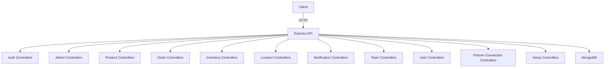

# Supply Chain API Documentation

Comprehensive documentation for all routes in the system, including request/response examples, the importance of each route, and a general architecture diagram.

---

## 🗺️ Architecture Overview



---

## Table of Contents

| Domain                                    | Description                                |
| ----------------------------------------- | ------------------------------------------ |
| [Admin](#admin)                           | Manage companies and approvals             |
| [Auth](#auth)                             | Authentication, registration, verification |
| [Inventory](#inventory)                   | Inventory management                       |
| [Location](#location)                     | Manage locations (warehouses, stores)      |
| [Notification](#notification)             | Notifications                              |
| [Order](#order)                           | Order management                           |
| [Partner Connection](#partner-connection) | Business relationships                     |
| [Product](#product)                       | Product management                         |
| [Setup](#setup)                           | System setup                               |
| [Team](#team)                             | Team management and invitations            |
| [User](#user)                             | User management                            |

---

## <a name="admin"></a>🛡️ Admin Controllers

### approveCompany.controller.js

| Method | Endpoint                     | Auth  | Description                        |
| ------ | ---------------------------- | ----- | ---------------------------------- |
| POST   | /api/admin/companies/approve | Admin | Approve a new company registration |

**Request Example:**

```json
{
  "companyId": "64f1a2b3c4d5e6f7a8b9c0d1"
}
```

**Response Example:**

```json
{
  "success": true,
  "message": "Company approved successfully"
}
```

**Importance:** Only admins can approve new companies, ensuring control over system access.

---

### getPendingCompanies.controller.js

| Method | Endpoint                     | Auth  | Description                        |
| ------ | ---------------------------- | ----- | ---------------------------------- |
| GET    | /api/admin/companies/pending | Admin | Get all companies pending approval |

**Response Example:**

```json
[
  {
    "id": "64f1a2b3c4d5e6f7a8b9c0d1",
    "name": "Company A",
    "status": "pending"
  }
]
```

**Importance:** Allows admins to review companies before approval.

---

## <a name="auth"></a>🔐 Auth Controllers

| Endpoint                        | Method | Auth   | Purpose                                |
| ------------------------------- | ------ | ------ | -------------------------------------- |
| /api/auth/register              | POST   | Public | Register a new user                    |
| /api/auth/login                 | POST   | Public | User login                             |
| /api/auth/logout                | POST   | User   | User logout                            |
| /api/auth/forgot-password       | POST   | Public | Request password reset                 |
| /api/auth/reset-password        | POST   | Public | Reset password                         |
| /api/auth/verify-email/:token   | GET    | Public | Email verification                     |
| /api/auth/resend-verification   | POST   | Public | Resend verification email              |
| /api/auth/enable-2fa            | POST   | User   | Enable two-factor authentication       |
| /api/auth/verify-2fa            | POST   | User   | Verify 2FA setup                       |
| /api/auth/confirm-2fa           | POST   | Public | Confirm 2FA login                      |
| /api/auth/complete-registration | POST   | Public | Complete registration after invitation |

### Register Example

**Request:**

```json
{
  "name": "Ali",
  "email": "ali@example.com",
  "password": "StrongPassword123"
}
```

**Response:**

```json
{
  "success": true,
  "user": {
    "id": "64f1a2b3c4d5e6f7a8b9c0d1",
    "email": "ali@example.com"
  }
}
```

**Importance:** All authentication and account security operations.

---

## <a name="inventory"></a>📦 Inventory Controllers

| Endpoint           | Method | Auth                  | Purpose                     |
| ------------------ | ------ | --------------------- | --------------------------- |
| /api/inventory     | GET    | admin, manager, staff | Get all inventory items     |
| /api/inventory/:id | GET    | admin, manager, staff | Get specific inventory item |
| /api/inventory/:id | PATCH  | admin, manager        | Update inventory item       |

<!-- You can add POST if it actually exists in the project -->

**Request Example (Update):**

```json
{
  "quantity": 150,
  "location": "Warehouse 2"
}
```

**Response Example:**

```json
{
  "status": "success",
  "data": {
    "id": "inv123",
    "product": "64f1a2b3c4d5e6f7a8b9c0d1",
    "quantity": 150
  }
}
```

**Importance:** Precise inventory management with specific permissions based on job roles.

---

## <a name="location"></a>📍 Location Controllers

| Endpoint           | Method | Auth | Purpose               |
| ------------------ | ------ | ---- | --------------------- |
| /api/locations     | POST   | User | Add new location      |
| /api/locations     | GET    | User | Get all locations     |
| /api/locations/:id | GET    | User | Get specific location |
| /api/locations/:id | PUT    | User | Update location       |
| /api/locations/:id | DELETE | User | Delete location       |

**Request Example (Create):**

```json
{
  "name": "Warehouse 1",
  "address": "123 Main St"
}
```

**Response Example:**

```json
{
  "success": true,
  "location": {
    "id": "loc123",
    "name": "Warehouse 1"
  }
}
```

**Importance:** Organize storage and distribution points.

---

## <a name="notification"></a>🔔 Notification Controllers

| Endpoint                    | Method | Auth | Purpose                        |
| --------------------------- | ------ | ---- | ------------------------------ |
| /api/notifications          | POST   | User | Create new notification        |
| /api/notifications          | GET    | User | Get all notifications          |
| /api/notifications/:id      | GET    | User | Get specific notification      |
| /api/notifications/:id      | DELETE | User | Delete notification            |
| /api/notifications/all      | DELETE | User | Delete all notifications       |
| /api/notifications/:id/read | PUT    | User | Mark notification as read      |
| /api/notifications/read-all | PUT    | User | Mark all notifications as read |
| /api/notifications/send     | POST   | User | Send notification to users     |

**Request Example (Create):**

```json
{
  "title": "New Order",
  "message": "You have a new order."
}
```

**Response Example:**

```json
{
  "success": true,
  "notification": {
    "id": "notif123",
    "title": "New Order"
  }
}
```

**Importance:** Keep users up to date.

---

## <a name="order"></a>📑 Order Controllers

| Endpoint               | Method | Auth | Purpose             |
| ---------------------- | ------ | ---- | ------------------- |
| /api/orders            | POST   | User | Create new order    |
| /api/orders            | GET    | User | Get all orders      |
| /api/orders/:id        | GET    | User | Get specific order  |
| /api/orders/:id        | DELETE | User | Delete order        |
| /api/orders/received   | GET    | User | Get received orders |
| /api/orders/sent       | GET    | User | Get sent orders     |
| /api/orders/:id/status | PUT    | User | Update order status |

**Request Example (Create):**

```json
{
  "supplier": "64f1a2b3c4d5e6f7a8b9c0d1",
  "items": [{ "product": "prod123", "quantity": 10 }],
  "totalAmount": 1000,
  "currency": "USD",
  "notes": "Urgent order",
  "requestedDeliveryDate": "2024-06-15",
  "deliveryAddress": "123 Main St",
  "billingAddress": "456 Billing Rd",
  "paymentTerms": "Net 30",
  "tags": ["priority"]
}
```

**Response Example:**

```json
{
  "status": "success",
  "data": {
    "id": "order123",
    "orderNumber": "ORD-1718123456789",
    "status": "pending"
  }
}
```

**Importance:** Manage purchase and sales operations between companies with complete tracking of orders and their details.

---

## <a name="partner-connection"></a>🤝 Partner Connection Controllers

| Endpoint                                | Method | Auth | Purpose                       |
| --------------------------------------- | ------ | ---- | ----------------------------- |
| /api/partner-connections                | POST   | User | Create new partner connection |
| /api/partner-connections                | GET    | User | Get all partner connections   |
| /api/partner-connections/:id            | GET    | User | Get specific connection       |
| /api/partner-connections/:id            | DELETE | User | Delete connection             |
| /api/partner-connections/:id/terminate  | PUT    | User | Terminate connection          |
| /api/partner-connections/:id/status     | PUT    | User | Update connection status      |
| /api/partner-connections/:id/visibility | PUT    | User | Update connection visibility  |

**Request Example (Create):**

```json
{
  "partnerCompanyId": "64f1a2b3c4d5e6f7a8b9c0d1"
}
```

**Response Example:**

```json
{
  "success": true,
  "connection": {
    "id": "conn123",
    "status": "active"
  }
}
```

**Importance:** Build a business network between companies.

---

## <a name="product"></a>🛒 Product Controllers

| Endpoint          | Method | Auth | Purpose              |
| ----------------- | ------ | ---- | -------------------- |
| /api/products     | POST   | User | Add new product      |
| /api/products     | GET    | User | Get all products     |
| /api/products/:id | GET    | User | Get specific product |
| /api/products/:id | PUT    | User | Update product       |
| /api/products/:id | DELETE | User | Delete product       |

**Request Example (Create):**

```json
{
  "name": "Product X",
  "sku": "SKU123",
  "unitPrice": 100,
  "currency": "USD"
}
```

**Response Example:**

```json
{
  "success": true,
  "product": {
    "id": "prod123",
    "name": "Product X"
  }
}
```

**Importance:** Manage each company's product catalog.

---

## <a name="setup"></a>⚙️ Setup Controllers

| Endpoint         | Method | Auth    | Purpose                    |
| ---------------- | ------ | ------- | -------------------------- |
| /api/setup/admin | POST   | Special | Create main platform admin |

**Request Example:**

```json
{
  "name": "Super Admin",
  "email": "admin@example.com",
  "password": "StrongPassword123"
}
```

**Response Example:**

```json
{
  "success": true,
  "admin": {
    "id": "admin123",
    "email": "admin@example.com"
  }
}
```

**Importance:** Initial system setup.

---

## <a name="team"></a>👥 Team Controllers

| Endpoint                       | Method | Auth   | Purpose                |
| ------------------------------ | ------ | ------ | ---------------------- |
| /api/team/invite               | POST   | User   | Invite new team member |
| /api/team/verify-invite/:token | GET    | Public | Verify team invitation |

**Request Example (Invite):**

```json
{
  "email": "newuser@example.com",
  "role": "staff"
}
```

**Response Example:**

```json
{
  "success": true,
  "message": "Invitation sent"
}
```

**Importance:** Expand the company team.

---

## <a name="user"></a>👤 User Controllers

| Endpoint   | Method | Auth | Purpose       |
| ---------- | ------ | ---- | ------------- |
| /api/users | GET    | User | Get all users |

**Response Example:**

```json
[
  {
    "id": "user123",
    "name": "Ali",
    "email": "ali@example.com"
  }
]
```

**Importance:** Manage users within the company.

---

> **Note:** All routes requiring authentication expect the token in the header:  
> `Authorization: Bearer <token>`

---

## <a name="invoice"></a>💸 Invoice Controllers


### 📌 1. Generate Invoice from Order

| Method | Endpoint                          | Auth | Description                           |
|--------|-----------------------------------|------|---------------------------------------|
| POST   | /api/invoice/from-order/:orderId | User | Generate an invoice from an order     |

**Request Example:**

```http
POST /api/invoice/from-order/664fb123bcfecc0012391a7e
Headers:
  token: <user_token>
```

**Response Example:**

```json
{
  "message": "Invoice generated from order successfully",
  "invoice": {
    "invoiceNumber": "INV-1717773215000",
    "status": "accepted",
    "totalAmount": 114,
    "relatedOrder": "664fb123bcfecc0012391a7e"
  }
}
```

**Importance:** Automatically generates invoice with tax and details based on a sales order.

---

### 📌 2. Get All Invoices for a Company

| Method | Endpoint         | Auth | Description                        |
|--------|------------------|------|------------------------------------|
| GET    | /api/invoice/    | User | Fetch all invoices (sent/received) |

**Response Example:**

```json
{
  "count": 2,
  "invoices": [
    {
      "invoiceNumber": "INV-1717773215000",
      "totalAmount": 114,
      "issuer": { "name": "ChainFlow" },
      "receiver": { "name": "Ali Co." },
      "status": "accepted"
    }
  ]
}
```

**Importance:** Allows companies to see all invoices related to them.

---

### 📌 3. Get Single Invoice Details

| Method | Endpoint                | Auth | Description                  |
|--------|-------------------------|------|------------------------------|
| GET    | /api/invoice/:invoiceId | User | Fetch invoice by ID          |

**Response Example:**

```json
{
  "invoice": {
    "invoiceNumber": "INV-1717773215000",
    "issuer": { "name": "ChainFlow" },
    "receiver": { "name": "Ali Co." },
    "items": [
      {
        "description": "Subscription service",
        "quantity": 1,
        "unitPrice": 100,
        "taxRate": 14,
        "total": 100
      }
    ],
    "totalSales": 100,
    "totalTax": 14,
    "totalAmount": 114
  }
}
```

**Importance:** View full invoice details for review or printing.

---

### 📌 4. Download Invoice as PDF

| Method | Endpoint                    | Auth | Description                       |
|--------|-----------------------------|------|-----------------------------------|
| GET    | /api/invoice/:id/pdf        | User | Download the invoice as a PDF     |

**Headers:**

```
token: <user_token>
```

**Response:** Returns a real downloadable PDF of the invoice.

**Importance:** Exporting invoice for printing or sending to client via email.

---

📌 **Note**: PDF generation is powered by **Puppeteer** + **Handlebars** using a clean HTML template.