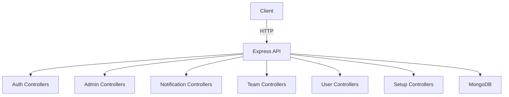

# Supply Chain API Documentation

Comprehensive documentation for all routes in the system, including request/response examples, the importance of each route, and a general architecture diagram.

---

## 🗺️ Architecture Overview


```mermaid
graph TD
  A[Client] -->|HTTP| B[Express API]
  B --> C[Auth Controllers]
  B --> D[Admin Controllers]
  B --> I[Notification Controllers]
  B --> J[Team Controllers]
  B --> K[User Controllers]
  B --> M[Setup Controllers]
  B --> N[MongoDB]
```

---

## Table of Contents

| Domain                        | Description                                |
| ----------------------------- | ------------------------------------------ |
| [Admin](#admin)               | Manage companies and approvals             |
| [Auth](#auth)                 | Authentication, registration, verification |
| [Notification](#notification) | Notifications                              |
| [Setup](#setup)               | System setup                               |
| [Team](#team)                 | Team management and invitations            |
| [User](#user)                 | User management                            |

---

## <a name="admin"></a>🛡️ Admin Controllers

### approveCompany.controller.js

| Method | Endpoint                        | Auth           | Description                        |
| ------ | ------------------------------- | -------------- | ---------------------------------- |
| PATCH  | /api/admin/approve-company/:id  | Platform Admin | Approve a new company registration |

**Request Example:**

```json
{
  "companyId": "64f1a2b3c4d5e6f7a8b9c0d1"
}
```

**Response Example:**

```json
{
  "success": true,
  "message": "Company approved successfully"
}
```

**Importance:** Only platform admins can approve new companies, ensuring control over system access.

---

### getPendingCompanies.controller.js

| Method | Endpoint                        | Auth           | Description                        |
| ------ | ------------------------------- | -------------- | ---------------------------------- |
| GET    | /api/admin/pending-companies    | Platform Admin | Get all companies pending approval |

**Response Example:**

```json
[
  {
    "id": "64f1a2b3c4d5e6f7a8b9c0d1",
    "name": "Company A",
    "status": "pending"
  }
]
```

**Importance:** Allows platform admins to review companies before approval.

---

## <a name="auth"></a>🔐 Auth Controllers

| Endpoint                        | Method | Auth   | Purpose                                |
| ------------------------------- | ------ | ------ | -------------------------------------- |
| /api/auth/register              | POST   | Public | Register a new user                    |
| /api/auth/login                 | POST   | Public | User login                             |
| /api/auth/logout                | POST   | User   | User logout                            |
| /api/auth/forgot-password       | POST   | Public | Request password reset                 |
| /api/auth/reset-password        | POST   | Public | Reset password                         |
| /api/auth/verify/:token         | GET    | Public | Email verification                     |
| /api/auth/resend-verification   | GET    | User   | Resend verification email              |
| /api/auth/enable-2fa            | POST   | User   | Enable two-factor authentication       |
| /api/auth/verify-2fa            | POST   | User   | Verify 2FA setup                       |
| /api/auth/confirm-2fa-login     | POST   | User   | Confirm 2FA login                      |

### Register Example

**Request:**

```json
{
  "name": "Ali",
  "email": "ali@example.com",
  "password": "StrongPassword123"
}
```

**Response:**

```json
{
  "success": true,
  "user": {
    "id": "64f1a2b3c4d5e6f7a8b9c0d1",
    "email": "ali@example.com"
  }
}
```

**Importance:** All authentication and account security operations.

---

## <a name="notification"></a>🔔 Notification Controllers

| Endpoint                    | Method  | Auth           | Purpose                        |
| --------------------------- | ------- | -------------- | ------------------------------ |
| /api/notification/          | GET     | Any Auth Role  | Get all notifications          |
| /api/notification/          | POST    | Admins Only    | Create new notification        |
| /api/notification/:id       | GET     | Any Auth Role  | Get specific notification      |
| /api/notification/:id       | DELETE  | Any Auth Role  | Delete notification            |
| /api/notification/:id/read  | PATCH   | Any Auth Role  | Mark notification as read      |
| /api/notification/read-all  | PATCH   | Any Auth Role  | Mark all notifications as read |
| /api/notification/          | DELETE  | Any Auth Role  | Delete all notifications       |

**Request Example (Create):**

```json
{
  "title": "New Order",
  "message": "You have a new order."
}
```

**Response Example:**

```json
{
  "success": true,
  "notification": {
    "id": "notif123",
    "title": "New Order"
  }
}
```

**Importance:** Keep users up to date.

---

## <a name="setup"></a>⚙️ Setup Controllers

| Endpoint                      | Method | Auth           | Purpose                    |
| ----------------------------- | ------ | -------------- | -------------------------- |
| /api/setup/create-platform-admin | POST   | Public         | Create main platform admin |

**Request Example:**

```json
{
  "name": "Super Admin",
  "email": "admin@example.com",
  "password": "StrongPassword123"
}
```

**Response Example:**

```json
{
  "success": true,
  "admin": {
    "id": "admin123",
    "email": "admin@example.com"
  }
}
```

**Importance:** Initial system setup.

---

## <a name="team"></a>👥 Team Controllers

| Endpoint                          | Method | Auth   | Purpose                |
| --------------------------------- | ------ | ------ | ---------------------- |
| /api/team/invite                  | POST   | Admin  | Invite new team member |
| /api/team/verify-invite/:token    | GET    | Public | Verify team invitation |

**Request Example (Invite):**

```json
{
  "email": "newuser@example.com",
  "role": "staff"
}
```

**Response Example:**

```json
{
  "success": true,
  "message": "Invitation sent"
}
```

**Importance:** Expand the company team.

---

## <a name="user"></a>👤 User Controllers

| Endpoint                | Method | Auth   | Purpose           |
| ----------------------- | ------ | ------ | ----------------- |
| /api/users/get-all-employee | GET    | Admin  | Get all employees |

**Response Example:**

```json
[
  {
    "id": "user123",
    "name": "Ali",
    "email": "ali@example.com"
  }
]
```

**Importance:** Manage users within the company.

---

> **Note:** All routes requiring authentication expect the token in the header:  
> `Authorization: Bearer <token>`

---
